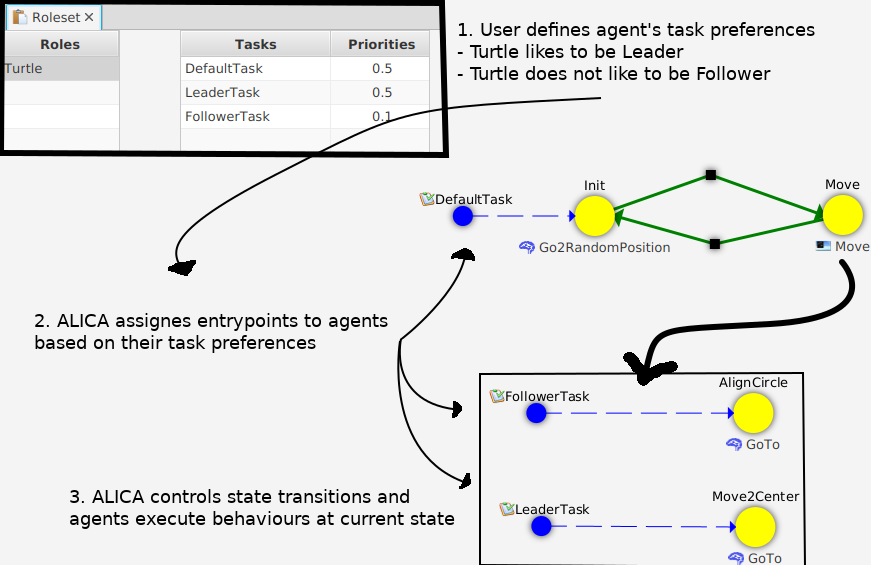
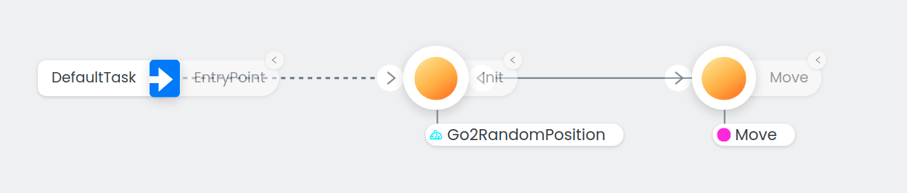
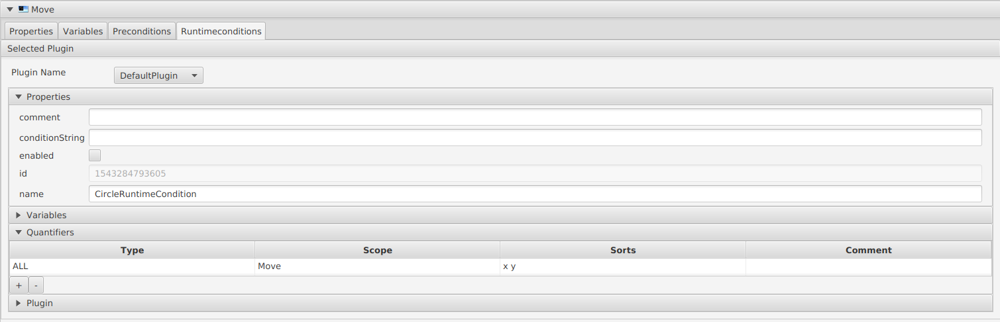
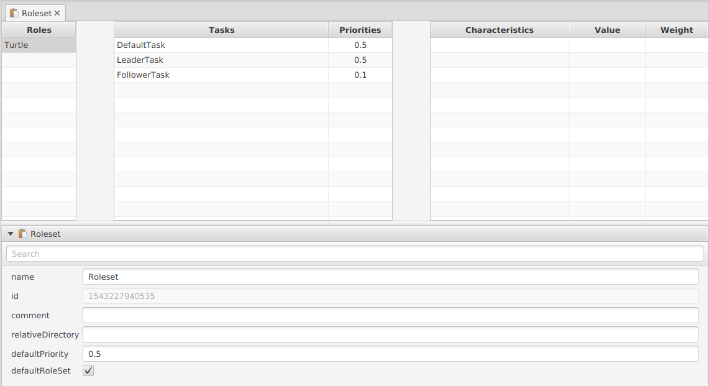

# Turtlesim Tutorial
## 1. Overview
This tutorial is extension of the [turtlesim ROS package](http://wiki.ros.org/turtlesim). By following this tutorial, you will learn 
- the core concepts of the ALICA language
- how to achieve multi-agent collaboration with the ALICA framework

In this tutorial, you will create an application as shown in the picture below. The ALICA engine will assign the “Leader” task to one turtle and the “Follower” task to the other turtles. Further, the ALICA engine will move the turtles to their goal positions based on distance constraints.


## 2. Prerequisite
You need to be familiar with following topics and tools:
- [ROS Melodic](http://wiki.ros.org/melodic/Installation/Ubuntu)
- [catkin_tools](https://catkin-tools.readthedocs.io/en/latest/installing.html)

## 3. The ALICA Language - Basics and Core Concepts
We will only give you a brief explanation on the ALICA core concepts. For the interested reader, we recommend to consider the resources on the [ALICA Homepage](https://www.uni-kassel.de/eecs/fachgebiete/vs/research/alica.html) of the Distributed Systems Department of the University of Kassel for more detailed information in a series of related publications.
### Plan
A plan is a state machine in tree structure. Plans can include plans and states and each state has can include`Behaviour`s. The ALICA engine assigns entrypoints of the  plan tree to the agents, e.g., robots based on `Role`, `Task`, `Constraints` and `Utility function`.
The ALICA engine manages state transitions based on the developers code. The ALICA plan designer generates method stubs that a developer will fill with state transition logic. The developer can create plans using the ALICA plan designer.

### Behaviour
The developer can write robot behaviours in C++ for each state. The ALICA plan designer generates method stubs and the developer implements the behaviour logic in these stubs. In this tutorial, there are the `Go2RandomPosition` and `GoTo` behaviour.
The turtles are teleported to random position with `Go2RandomPosition` and they go to their target position with  the `GoTo` behaviour.

### Role

A role is a task preference of the agent and it describes physical difference among agents , e.g., differences between a robotic arm and an AGV. In this tutorial all agent have same role:  `Turtle`

### Task
A task is assigned to an agent based on the `Role` of that agent and based on the `Utility function` of the plan. A task identifies an entry point of a state machine. The ALICA engine realises multi-agent collaboration by assigning tasks to agents. In this tutorial, there are the `Leader` and the `Follower` task. One turtle is assigned the `Leader` task and it moves to the centre. The other turtles are assigned the `Follower` task and they align in a circle.
### Constraints
Developers can set constraints to plans. The ALICA engine can solve constraints and return corresponding answers. In this tutorial, the turtles align in a circle defined by distance constraints.

### Worldmodel

The world model represents the model of the world from the perspective of an agent. Further, the world model can be an interface between the ALICA engine and other software, e.g., ROS and lower API.



## 4. Setup of the Catkin Workspace
We need to creating a catkin workspace by executing the following steps in an Ubuntu18.04 terminal.

1. Check out the required repositories:

```
mkdir -p catkin_ws/src
cd catkin_ws/src
git clone https://github.com/rapyuta-robotics/alica.git
git clone https://github.com/rapyuta-robotics/alica-essentials.git
git clone https://github.com/rapyuta-robotics/alica-supplementary.git
```

2. Remove existing turtlesim files. You will reproduce these files (You can jump to step 8. "Build and Run" for testing application before deleting the files):

```
cd src/alica-supplementary
rm -r alica_ros_turtlesim/Expr 
rm -r alica_ros_turtlesim/alica
```

3. Create the alica_ros_turtlesim package with additional subfolders:

```
catkin_create_pkg alica_ros_turtlesim roscpp turtlesim geometry_msgs alica_engine agent_id alica_ros_proxy constraintsolver
mkdir -p alica_ros_turtlesim/alica/etc/plans/behaviours
mkdir -p alica_ros_turtlesim/alica/etc/roles
mkdir -p alica_ros_turtlesim/alica/etc/Misc
mkdir -p alica_ros_turtlesim/Expr
```

## 5. Setup of the ALICA Plan Designer
The ALICA plan designer is a user interface to design applications with the ALICA framework.
### 5.1 Start the ALICA plan designer by following steps

The [GitHUB repository of the Plan Designer](https://github.com/rapyuta-robotics/alica-plan-designer-fx) includes the different releases of the Plan Designer. Download the two JAR-files from the latest release on the [release page](https://github.com/rapyuta-robotics/alica-plan-designer-fx/releases) and place them in a folder structure like this:

```
~/alica_plan_designer/PlanDesignerFX-X.Y.Z.jar
~/alica_plan_designer/plugins/alica-plan-designer-fx-default-plugin-X.Y.Z-SNAPSHOT.jar
```

For starting the Plan Designer, you must have [Java OpenJDK 11 installed](https://wiki.ubuntuusers.de/Java/Installation/OpenJDK/) and [set as your default Java version](https://computingforgeeks.com/how-to-set-default-java-version-on-ubuntu-debian/). Afterwards you can start the Plan Designer with the following command on your terminal:

```
cd ~/alica_plan_designer
java -jar PlanDesignerFX-X.Y.Z.jar
```

 When you start the Plan Designer the first time, its main window should look like this:


### 5.2 Configure the Plan Designer

1. Open the *Edit* menu from the top menu bar and choose *Configure* in order to open the Configuration window:
2. Fill out the fields one after another.
   1. **Source Code Editor:** The Plan Designer supports to open auto generated code from within the Plan Designer. For this it will open the editor you will enter in this field, parametrised with the path to the respective auto generated file. At the moment, probably only "gedit" will work.
   2. **Clang Formatter:** Just enter "clang-format". Nothing else is supported at the moment.
   3. **Available Configurations:** As no configuration is available, yet, you need to create one by double clicking on the first empty line under *Available Configurations* and enter a name for your configuration, e.g. alica_ros_turtlesim. Press *Enter* to confirm your entry.
   4. **Plans Folder:** Enter the path to your projects plan-folder.
   5. **Roles Folder:** Enter the path to your projects roles-folder.
   6. **Tasks Folder:** Enter the path to your projects tasks-folder.
   7. **Gen-Src Folder:** Enter the path to the folder, where you want the Plan Designer to generate its source code into.
   8. **Plugins Folder:** Enter the path to folder with the code generation plugins, you want to use. Most likely choose the path that includes the JAR of the Default Plugin module. Please note that if there are other JARs in the plugin folder, which are no plugin for the Plan Designer, it is likely that this will cause issues like NullPointerException and similar.
   9. **Default Plugin:** Choose the code generation plugin, that should be configured as default plugin from the drop down menu. If nothing shows up, the configured *Plugins Folder* does not contain a code generation plugin.
3. Save the configuration and set it active. If something goes wrong at this point, you probably have made a mistake in the last step.

## 6. Create the Tutorial Plans with the Plan Desginer
In this section, you will create plans using the ALICA plan designer. In this tutorial there are two plans, `Master` and `Move`. The `Master` plan has an `Init` and `Move` state.  The `Move` plan includes the `Move2Center` and the `AlignCircle` state. In the `Init` state, the turtle is teleported to a random position (`Go2RandomPosition` behaviour) and then transitions to the `Move` state. 


## 6.1 Create the Master Plan	

1. Right click on the plans folder of the FileTreeView -> New -> Plan
2. Input Filename with `Master` then the plan will be opened.
3. Check the masterPlan checkbox in the properties (Icon should turn red).
4. Add states named `Init` and `Move`
5. Add transition from `Init` to `Move` and from `Move` to `Init` (Bendpoints can be created by clicking with the active transition tool onto a transition).
6. Create an entrypoint (choose default task) and connect it with the `Init` state. 
7. Create the behaviour subfolder in the plans folder of the FileTreeView.
8. Create the `Go2RandomPosition` behaviour in the behaviour subfolder .
9. Drag'n'Drop the `Go2RandomPosition` behaviour from the RepositoryView to the `Init` state.
10. Create the `Move` plan in the plans folder and drag'n'drop it into the `Move` state.

### 6.2 Move plan

1. Open the `Move` plan and add two states:  `Move2Center` and `AlignCircle` 
2. Add two entrypoints with new tasks: `Leader` and `Follower`
3. Connect the `Leader` Task-Entrypoint to `Move2Center` and the `Follower` Task-EntryPoint to AlignCircle.
4. Create the `GoTo` behaivour under /plans/behaviours and add it to the  `Move2Center` state and the `AlignCircle` state 
5. Add a “Runtime Condition” to the `Move` plan by choosing the default plugin for it.
6. Add “x y” “Quantifiers” in Runtime condition properties
      * these quantifiers will be used in writing constraints.
      

### 6.3 Create the RoleSet

1. Create a the Roleset in the roles folder
2. Define Role “Turtle”
3. Check the defaultRoleSet checkbox
4. Set Priority of FollowerTask to 0.1
5. 

### 6.4 Generate Method Stubs

Start the code generation by opening the  "Codegeneration" menu and choose "Generate Code". Everything will be generated into the Expr folder of the alica_ros_turtlesim package.

## 7. Implement Logics 

After the ALICA plan designer generated the method stubs, you need to modify/implement the logic in these stubs. In this section, the necessary code changes are explained for this. 
### 7.1 World model

We will explain only `base.cpp` which is related to ALICA. 


- L21: initialize World model. Since one agent has one world model, this method is class static method
- L23~28: Setting up AlicaContext. AlicaContext is the interface class of the ALICA engine.
- L31~36: Starting the AlicaContext.

### 7.2 Plans

The ALICA plan designer generated everything plan related into the Expr folder, split into src and include. The Expr/src/<plan_name><plan_id>.cpp files include "evaluate" functions that control the transition between states of that plan. The Expr/src/constraints/<plan_name><plan_id>Constraints.cpp files include the "getConstraints" functions which provide the constraints. The frequency for calling these functions can be configured in the Alica.conf file under alica/etc. The IDs in the file names are generated by the ALICA plan designer.

#### Expr/src/Plans/Master<id>.cpp

In this file, you need to implement state transition logic.


- L4 : include world model since state transitions depend on the world model

- L41:  This is state transition condition from ‘Init’ to ‘Move’. This success condition is met by setSuccess in behaviour logic which is explained later in behaviour.
- L64: This is state transition condition from ‘Move’ to ‘Init’. This condition is met by publishing rostopic ‘/init’.

#### Expr/src/Plans/constraints/Move<id>Constraints.cpp

In this file, you need to implement constraints logic.
  

  - L3~7: include alica engine related header files and world model.    
  - L46~110: Iterate over all agents and add constraints for each
  - L47~73: Preparing/getting variables and add range constraints
  - L77: add constraints for `Leader` agent. Leader agent moves to center of circle within tolearence
  - L81~L108: Iterate other agent to add constraints to keep distance among `Follower` agents.

### 7.3  Behaviours
The auto-generated <behaviour_name>.cpp files under Expr/src/Behaviours  have a "run" function which keeps running at a specific frequency which is set in Alica.conf.
#### Expr/src/Behaviours/Go2RandomPosition.cpp

In this file, you need to implement the teleportation of the  turtles:


- L6: include world model
- L34-41: generate random value and teleport turtle via world model.
- L41: After execute `setSuccess()` function, "isAnyChildStatus(PlanStatus::Success)"" at Expr/src/Plans/Master***.cpp return true. Then state transition from `Init` to `Move` happen.

#### Expr/src/Behaviours/GoTo.h


- L6: include Query
- L28-29: add query and result which are used to get solver result.

#### Expr/src/Behaviours/GoTo.cpp


- L6: include world model
- L34~38: In `run` function,  get result from solver. CGSolver solve constraints defined in the  Expr/src/Plans/constraints/Move***.cpp
- L39~42: move turtle to the solver result position via world model.
- L50~53: add variable to query. “x” and “y” was defined when  “Quantifiers” of “Runtime Condition” was added in the ALICA plan designer

## 8. Build and Run
### 8.1 Build
follow the standard ros build step.
```
cd catkin_ws
source /opt/ros/kinetic/setup.bash
catkin build alica_ros_turtlesim
```
### 8.2 Run
Run application with roslaunch. video
- Launch turtlesim
			`roslaunch alica_ros_turtlesim env.launch`
- Turtle node(you can launch turtle with different name till 5 turtles)
`roslaunch alica_ros_turtlesim turtle.launch name:=turtle1`
- Start moving. 
`rostopic pub /init std_msgs/Empty "{}" `
