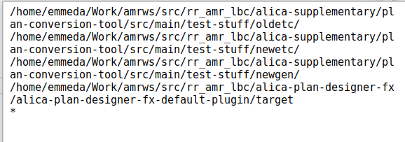

# Plan Conversion Tool (PCT)

The purpose of the Plan Conversion Tool (PCT) is to convert ALICA plans from the XML format of the old Plan Designer to the JSON format of the new Plan Designer. While the new Plan Designer has plenty advantages over the the old Plan Designer, the reason for choosing JSON over XML is because it is getting a more  common format in most web-related areas.

## How PCT works / Dependencies

The PCT is capable of parsing the XML format on its own. While parsing it creates a runtime model of the parsed plan elements. For the runtime model, the PCT utilises the Model module of the new Plan Designer, because then this runtime model can be passed to an instance of the ModelManager class of the new Plan Designer. This ModelManager is capable of serialising the given plan elements in the JSON format of the new Plan Designer. 

As a result, the PCT does not depend on the old Plan Designer in any way, but depends on the Model, ModelManagement, and Codegeneration Module of the new Plan Designer and therefore, requires OpenJDK 11 or higher.

The dependency to the Codegeneration Module is necessary, because the PCT is also capable of triggering the auto-generation of source code of the new Plan Designer. The templates of the new Plan Designer also got improved and thereby modified. In order to port the handwritten source code (located in Protected Regions) to the auto-generation format of the new Plan Designer it is necessary to do this in a cautious way, in order to avoid the loss of some handwritten code.

## How to setup and compile the PCT

The new Plan Designer and the PCT are Maven-based projects and developed with Jetbrains' community-edition of Intellij. Although both generate executable JAR files, we currently find it more convenient to launch them from within Intellij. For setting up Intellij for the new Plan Designer, please consider its Readme.md in the alica-plan-designer-fx repository. In the following, the setup of the PCT is described:

1. Download the community edition of [Intellij](https://www.jetbrains.com/idea/download/).
2. Open Intellij and choose the [pom.xml](https://github.com/rapyuta-robotics/alica-supplementary/blob/json-plan-format/plan-conversion-tool/pom.xml) file for opening a project
3. In order to compile the PCT choose Maven window from the right double click on install. 
   Note: For this step, it is required, that you have compiled the new Plan Designer already and therefore have all JARs of the different Plan Designer modules located in your local Maven repository. Under Ubuntu, the local Maven repository is the ".m2" folder in your home directory.

## How to use PCT / Step-by-step

At the time of writing this manual, we already converted all plans and auto-generated source code from the [alica_tests](https://github.com/rapyuta-robotics/alica/tree/json-plan-format/alica_tests), [supplementary_tests](https://github.com/rapyuta-robotics/alica-supplementary/tree/rr-devel/supplementary_tests), [alica_ros_turtlesim](https://github.com/rapyuta-robotics/alica-supplementary/tree/json-plan-format/alica_ros_turtlesim), [constraintsolver](https://github.com/rapyuta-robotics/alica-supplementary/tree/json-plan-format/constraintsolver) package in the [alica](https://github.com/rapyuta-robotics/alica) and [alica-supplementary](https://github.com/rapyuta-robotics/alica-supplementary) repository. In the following, our best practise (so far) is described step by step:

1. Prepare work directories for the conversion process.

   
   1.1 We found it quit convenient to have folders, where you put the content of the original *etc* and *autogenerated* folder. They are denoted as *oldetc* and *oldgen* in the image above. Typically, the oldetc folder contains the *plans*, *Misc*, and *roles* folders, while the oldgen folder contains the *src* and *include* folder of the auto-generated source code, as it was generated by the old Plan Designer.

   1.2 Further, it is necessary to create a *newetc*, *newgen*, and *newgen-backup* folder, which you can leave empty for the moment.

2. Now please copy the src and include folder from the oldgen folder in to the newgen-backup folder.

3. **Read carefully:** Move the content of the Plans folders of the copied src and include folders into their parent directories and delete the empty Plans folders afterwards. For example: newgen-backup/src/Plans/Test.pml goes into newgen-backup/src/Test.pml and newgen-backup/include/Plans/Test.pml goes into newgen-backup/include/Test.pml.

4. Prepare Run/Debug configurations, by opening the following dialogue via the drop-down menu right to the green hammer symbol:

   4.1 Add the following **7** program arguments into a run/debug configuration (named Convert*) for converting all plans in the oldetc folder and storing them into the newetc folder:

   

   - The absolute path to the directory that contains the old plan files.
   - The absolute path to the directory that contains the old task repository file.
   - The absolute path to the directory that contains the old role set related files.
   - The absolute path to the newetc directory
   - The absolute path to the newgen directory
   - The absolute path to the directory, that contains the JAR of the Default Plugin for the new Plan Designer's code generation.
   - A '*' for stating that all *.pml files recursively found in the oldetc folder should be converted.

   4.2 Add another run/debug configuration for each role set in the roles folder and replace the '*' with the absolute path to the role set file. For example: /home/emmeda/Work/rrws/src/alica-supplementary/plan-conversion-tool/src/main/test-stuff/oldetc/roles/Roleset.rset

5. Copy the content of the newgen-backup folder into the newgen folder

6. Run the Convert* configuration, then each role set configuration, and finally the Convert* configuration again.

7. Delete the content of your project's autogenerated and etc folder and copy the content of the newgen and newetc folder to your project's folders.

Now you have converted all plan, behaviour, plantype, and roleset files. During this conversion the PCT prints several information to the console. As long as it did not throw an Exception, the PCT did not run into any unexpected situation. In order to understand the information, the PCT printed to the console, consider the explanations in the next section. If you want to **restart the conversion process** for some reason, do the following:

	1. Delete the content of the newgen and newetc folder.
 	2. Copy the content of the newgen-backup folder into the newgen folder.
 	3. Run the Convert* configuration, then each role set configuration, and finally the Convert* configuration again, just like in Step 6 from above.

## Explanation of Differences after Conversion

There are some differences and improvements, that come with the new Plan Designer, with regard to the auto-generated source code and serialised files: 

* The most obvious one is the missing Plans folder in the auto-generated src and include folder, which you removed manually in Step 3, from above. Adapt your manually added #include macros accordingly.
* All generated classes now belong to the namespace *alica* instead of *alicaAutogenerated*. Adapt your source accordingly.
* The new auto-generated files do no longer include "using namespace std;", because it pollutes your utilised namespace with all elements from the huge std namespace. The compiler might complain about missing "std::"s.
* We did not convert the *.pmlex files, because the coordinate system in the old Plan Designer had a systematic bug. New *.pmlex files will be generated, when you open the converted plans for the first time. All coordinates are set to 0, so that all elements will stack over each other. Once you rearranged the elements, you can commit the new *.pmlex files.

During the conversion, you might encounter the following output:

```c++
System.out.println("[Factory] Info - Normalising the name of annotated plan (ID: " + element.getId() + ") to 'Annotated + <Name of Encapsulated Plan>'.");
```

* An AnnotatedPlan encapsulates a plan inside a plan type and allows to activate and deactivate the plan in the plan type. As it is only possible to activate and deactivate AnnotatedPlans in the new Plan Designer, we standardised its name to "Annotated+<NameOfEncapsulatedPlan>". Original names are ignored.

```c++
System.out.println("[Factory] Info - Some element has an empty name in the old XML format. Gonna replace it with its ID: " + element.getId());
```

* If you have elements that have an empty name in the old format, it is replaced by the names ID in the new format. Note: This might lead to another filename, as the filename and element name needs to be in sync for the new Plan Designer.

```c++
System.out.println("[Factory] Info - The name '" + name + "' contains forbidden characters. Gonna replace it with the ID of the corresponding element: " + element.getId());
```

* The name of a plan or a behaviour is used to generate class names. In the old Plan Designer it was possible to use names that include characters, that wouldn't compile. In the new Plan Designer the UI forbids such characters. As the name field and its restriction to certain characters is used for the name of every element in a plan, it is likely that some names get replaced by the ID of the element. Note: This might lead to another filename, as the filename and element name needs to be in sync for the new Plan Designer.

```c++
System.out.println("[ConversionProcess] Info - Planning Problems are not supported anymore. Gonna ignore reference: '" + referenceString + "'");
```

* Planning Problems are an old artefact that got only partially ported from the really old Plan Designer, that generated C# source code. It is completely dropped in the Plan Designer and have never been supported by the C++ ALICA Engine.

```c++
System.out.println("[ConversionProcess] Info - New file ending for role sets is '*.rst'. Gonna rename file: " + fileToParse);
```

* All file endings consist of three letters  (*.beh, *.pml, *.pty). For consistency reasons, this is also applied to role sets. Old ending: **.rset* New ending: **.rst*

```c++
System.out.println("[ConversionProcess] Info - Role Definition Sets (*.rdefset) are included in Role Sets (*.rst) in the new Plan Designer. Gonna integrate '" + fileToParse + "'");
```

* There simply are not extra role definition files anymore. For a more sophisticated Role Assignment, this might change in the future, but for the currently static role assignment, it is superfluous.

```c++
System.out.println("[BehaviourFactory] Info - Behaviour Configurations are not supported anymore. Variables, frequency, deferring, eventDriven, and parameters are taken from configuration with ID: " + confID);
```

and

```c++
System.out.println("[BehaviourFactory] Info - Multiple Behaviour Configurations are not supported anymore. Dropping the configuration with ID: " + confID);
```

* There is only one set of parameters supported for behaviours in the new Plan Designer. This might change in future, but for now only the parameters of the first configuration are converted.

In case of further unexpected problems, please contact:
* Stephan Opfer (slack: [@Stephan](https://rapyuta-robotics.slack.com/team/UUUSVSSBY), mail: stephan.opfer@rapyuta-robotics.com)
