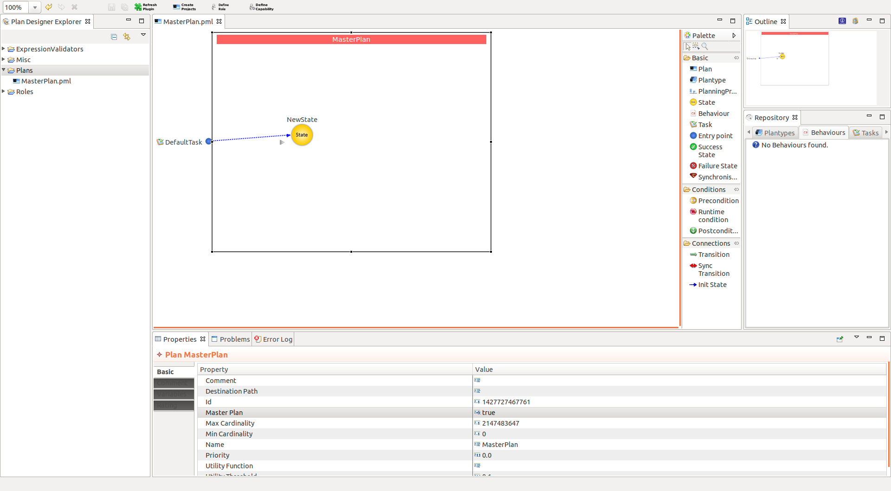

#Autogen code

**Explanation of Plan code**
* [PlanCode](docs/Plancode.md)

**Explanation of Plan constraint code**
* [PlanCode](docs/PlanConstraintCode.md)

**Explanation of Behavoiur code**
* [PlanCode](docs/BehCode.md)

**Explanation of Domain Behaviour**
* [PlanCode](docs/Domain.md)
