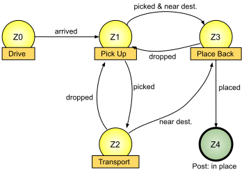

# Finite-State Machines

In this article, we only explain the specifics about finite-state machines in the ALICA language. Hence, we expect the reader to have a basic understanding of [finite-state machines in general](https://en.wikipedia.org/wiki/Finite-state_machine).

In the ALICA language, a finite-state machine (FSM) is comprised of a set of states that are connected by directed transitions. All states in an FSM of ALICA are at least weakly connected with each other, hence, FSMs in ALICA form a [weakly connected directed graph](https://en.wikipedia.org/wiki/Graph_(discrete_mathematics)#Types_of_graphs).

## States

The ALICA language distinguishes between normal states and terminal states. Normal states may contain an arbitrary number of [behaviours](behaviours.md), [plans](plans.md), and [plantypes](plantypes.md). When an agent enters a normal state, it tries to execute all elements in it. Terminal states must be empty and may have an annotated [postcondition](conditions.md). Further, terminal states are distinguished into success and failure states. 

## Transitions

Transitions are directed connections between states. At most two transitions between a pair of states (A,B) may exist: One from state A to state B (A -> B) and one from state B to state A (B -> A). Further, transitions always have an annotated [precondition](conditions.md) and cannot start and end at the same state. Finally, no outgoing transitions may be attached to terminal states.

## Execution of Finite-State Machines

An agent in one state automatically enters another state, if the [precondition](conditions.md) of the connecting transition holds. If the preconditions of multiple transitions hold at the same time, only on transition is chosen. When an agent enters a failure/success state the FSM failed/succeeded for that agent and, if present, the annotated [postcondition](conditions.md) of that terminal state is considered to hold.

A FSM can be executed by multiple agents at the same time. In that case, each agent is informing all other agents about its current state in the FSM.

### Example: Cleaning Up

