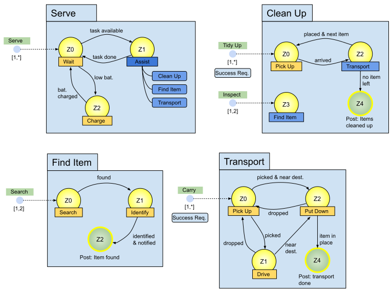
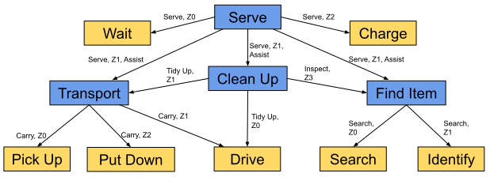

# Plan Trees

**Note:** Before reading this article, you should already know what core concepts a [plan](./plans.md) can include: behaviours, states, transitions, conditions, entrypoints, tasks, etc...

In the ALICA language it is possible to create plan trees by adding plans and plantypes into states (not just behaviours). In fact you can insert an arbitrary number and combination of behaviours, plans, and plantypes into a state.  Lets consider the following example with just one behaviour, plan, or plantype in each state to see how the plan tree hierarchy is build: 

*Figure 2: Plan Tree for Domestic Service Robots*

The *Serve* plan is the root of the plan hierarchy, depicted in Figure 2. In State *Z0* and *Z2* the two behaviours *Wait* and *Charge* are inserted, respectively, just like you have seen it before. However, State *Z1* includes the *Assist* plantype, which is composed of the three plans *Clean Up*, *Find Item*, and *Transport*. Since *Wait*, *Charge*, *Clean Up*, *Find Item*, and *Transport* are located in a state of *Serve*, they are denoted as the children of *Serve*. This all is in line of a classic [tree](https://en.wikipedia.org/wiki/Tree_(data_structure)) data structure. 

However, the *Clean Up* plan itself again includes the *Transport* and *Find Item* plan, which its parent already included as part of the *Assist* plantype. Therefore, the plan hierarchy shown in Figure 2 is not a plan tree, but a directed-acyclic graph (DAG) of plans with a single root plan as shown in Figure 3.

Figure 3: Visualisation of the Serve Plan Hierarchy as Directed-Acyclic Graph

The DAG in Figure 3 is the representation of an ALICA program at design time. Here, any change you make to, for example, the *Find Item* plan will be affect all its occurrences in the DAG. At runtime, however, the DAG will be interpreted as a tree and each occurrence of *Find Item* will be a different instance. This means, for example, that agents in different instances don't cooperate by sharing their progress in the FSMs and cannot contribute to the success of their instances together (see [Success Semantics of Plans](./plans.md)).

The annotations on the edges in Figure 3 state over which task, state, and plantype (optional) the child is connected to its parent. The edge between the *Serve* and *Clean Up* plan, for example, is annotated with (Serve, Z1, Assist), i.e. you reach the *Clean Up* plan when you take on task *Serve*, progress to state Z1, and choose the *Clean Up* plan from the plans in the *Assist* plantype. How this choice is made is described in more details in the [Utility Functions](./utility_functions.md) and [Task Allocation](./task_allocation.md) articles.

## Summary

Adding plans and plantypes into states allows to create multiple levels in the hierarchy of ALICA programs. In total, there are three different types of child-relationships in ALICA programs:

* **Behaviours:** (Plan)->(Task)->(State)->(Behaviour)
* **Plans:** (Plan)->(Task)->(State)->(Plan)
* **Plantypes:** (Plan)->(Task)->(State)->(Plantype)->(Plan)

At design time an ALICA program is considered a DAG, because behaviours, plans, and plantypes can be reused multiple times in different locations. At runtime this DAG is interpreted as tree.