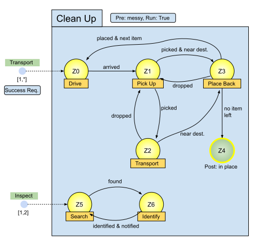

# Plan Trees

Now that you should understand a little of the core concepts of the propositional part of the ALICA language, it is a good idea to learn more about how those core concepts are composed. Before reading this article, you should already know what core concepts a [plan](./plans.md) can include: behaviours, states, transitions, conditions, entrypoints, tasks, etc...

*Figure 1: Plan for Cleaning up Items in a Household*

In Figure 1 you can see all these core concepts as you should already know them by the former articles about them. 

## Tree Structure

Now imagine this whole Clean Up plan is just one node in a [tree](https://en.wikipedia.org/wiki/Tree_(data_structure)), which is denoted as plan tree ALICA. This article answers the following questions: 

* What are parent-child relations in a plan tree?
* What are leaves in a plan tree?
* What does a complete plan tree look like?

### Parent-Child Relationships

Actually, you already know one example for a parent-child relationship in ALICA programs. All behaviours in the states of the finite-state machines (FSM) are children of the plan that owns the FSM. The Clean Up plan, for example, has 6 children which are all behaviours: Drive, Pick Up, Transport, Place Back, Search, and Identify. 

The other two parent-child relationships are plans or plantypes located in states, because additionally to behaviours, states can also include plans and plantypes. Since these included plans can include states on their own, they can again include plans, plantypes, or behaviours in their states.

Lets consider the following example of a small plan tree:

TODO: 

* Convert Plan-Tree example from thesis to svg.

* Introduce new annotation for plan trees:
  * (Plan)->(Task)->(State)->(Plan)
  * (Plan)->(Task)->(State)->(Plantype)->(Plan)
  * (Plan)->(Task)->(State)->(Behaviour)

### Trees and Leaves

A whole ALICA program is a single tree, as described in this article. Therefore, ALICA program and plan tree can be used interchangeable. Its root node is the top most plan in the hierarchy and behaviours represent its leaves.

Since an agent can only occupy a single state of each plan at a time, it is impossible for an agent to concurrently occupy multiple branches of the plan tree / ALICA program it is executing.