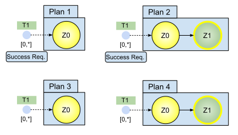

# Plans

As prerequisite to understand this article about plans, we require you to read the following articles first:

* [Behaviours](behaviours.md)
* [Finite-State Machines](finite-state_machines.md)
* [Conditions](conditions.md)
* [Entrypoints](entrypoints.md)
* [Tasks](tasks.md)

Quick recap: Finite-state machines (FSM) place behaviours into their states and connect them with precondition-guarded transitions. Terminal states can be used to signal the outcome of a FSM. Entrypoints determine the cardinalities of FSMs and point to their initial state. Tasks, annotated at entrypoints, abstractly describe what is done in a FSM.

Separating different goals into different FSMs makes sense from a [separation-of-concerns perspective](https://en.wikipedia.org/wiki/Separation_of_concerns). However, in many cases different goals contribute  to a common greater good. In such cases, FSMs need to be combined. Exactly this is the job of plans. Plans include the majority of all core concepts, which make plans the central core concept of the ALICA language. 

Let's consider the following example:

**Figure 1: Plan for Cleaning up Items in a Household**

Figure 1 shows a plan for cleaning up your household. The plan is made up of two FSMs. The upper FSM lets agents bring back items where they belong until no item is left. The lower FSM makes agents search for items that need to be cleaned. Both FSMs are annotated with an entrypoint (blue dot) that provides the cardinalities and task of that FSM. Further, the upper entrypoint states that its FSM is required to be successful, for the whole plan to be successful (see [Success Semantics](#Success-Semantics)). Finally, according to the precondition, the plan is only started when it is messy.

As you can see by the different tasks, the two FSMs have a different purpose but together they work towards the common goal of cleaning up your household. In the upper FSM (Transport task), agents need to carry things around, while in the lower FSM (Inspect task), agents need to identify items. This poses different requirements for the capabilities of the agents that are assigned to these FSMs. The problem of assigning agents to FSMs is solved by the ALICA Framework with the help of [tasks](tasks.md), [roles](roles.md), and [utility functions](utility_functions.md). Details can be found in the [task allocation article](task_allocation.md).

An open question now is: How do agents in the first FSM get to know about items found and identified by agents in the second FSM?

Obviously this part is about specifics of the household domain. Therefore, it would be fair to implement the domain-specific information sharing outside of the scope of the ALICA program and only provide the agents with available domain-specific information via the domain-specific code of behaviours and conditions. However, the core concepts of [General ALICA](../README.md#General-ALICA) also provide features to explicitly address this issue.

## Success Semantics

For the progress in an ALICA program, it is important to know when a plan is successful or when it failed. A plan is successful, if **all** success-required FSMs of the plan are successful. Further a FSM is successful, if the number of agents that reached the success state of the FSM is equal to or greater than the minimum cardinality of the entrypoint of the FSM. If the minimum cardinality is 0, then at least one agent needs to enter the success state of the FSM.

Figure 2 and Table 1 together explain some cave eats of the plan success semantics.

*Figure 2: The Success Semantics of Plans*

| Plan | Success  | Rationale                                                    |
| ---- | -------- | ------------------------------------------------------------ |
| 1    | Never    | The FSM is marked as "Success Required", but there is no success state to fulfil that. |
| 2    | Possible | If at least one agent reaches the success state, the Plan 2 is successful. |
| 3    | Always   | No FSM of Plan 3 is required to be successful for Plan 3 to be successful. Hence, Plan 3 is always successful. |
| 4    | Always   | Although Plan 4 has a success state, no FSM of Plan 4 is required to be successful. Hence, Plan 4 is always successful. |

The failure semantics of a plan is much easier: A plan failed, if an agent reached any failure state in the plan.

**NAV** *prev: [Tasks](tasks.md)*  *top: [Overview](../README.md)* *next: [Plantypes](plantypes.md)*