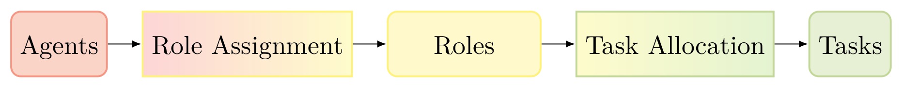

# Roles

The purpose of Roles is to abstract agents from [tasks](./tasks.md).

**Figure 1: Abstraction of Agents from Tasks via Roles.**

Figure 1 illustrates the process of assigning a task to an agent. First the agent needs to be assigned to a role and among other factors, the task allocation assigns a task to the agent based on its role. In the [task allocation](./task_allocation.md) algorithm, [utility functions](./utility_functions.md) are essential and the priority function, which is part of each utility function, especially influences the "assignment of tasks to roles". 

Let us see, how it works for the assignment of roles to agents. 

## Capabilities

An important notion in the context of assigning roles to agents is that of capabilities. A capability of a service robot, for example, is to move around and carry things. In ALICA we also understand properties as a potential capability. How abstract or detailed you want to specify your capabilities is not limited. Here are some other examples, that also include more property like capabilities:

* transport items
* localise yourself
* being able to communicate
* measure your battery levels
* can drive fast
* being huge
* have a camera

Now that we know what capabilities are, things become easy. In ALICA an agent is associated with a set of capabilities that it is able to execute or just posses. The same holds for a role, but the difference in semantics is that a role requires those capabilities to be fulfilled for an agent to take on that role and the agent just occupies its capabilities as long as its self-monitoring does not state otherwise. So for example, a mobile robot that has an arm can transport things. Therefore, it can take up the Transporter role as long as its self-monitoring does not recognise that its arm is broken. If it breaks the [role assignment](./role_assignment.md) algorithm will assign it another role.

**NAV** *prev: [Utility Functions](utility_functions.md)*  *top: [Overview](../README.md)* 

