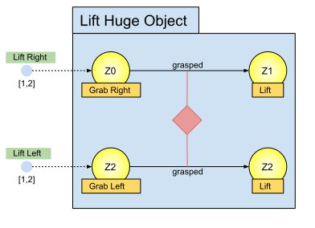

# Synchronisations

Synchronisations enforce a group of agents to pass over a set of transitions synchronously. The semantics of synchronisations is similar to that of [joint intentions](https://www.aaai.org/Papers/AAAI/1990/AAAI90-014.pdf).

*Figure 1: A Plan with Two Synchronised Transitions*

Figure 1 shows a plan for synchronously lifting a huge object. Two robots are necessary to execute this plan, as the minimum cardinality of both tasks is one. The idea of the plan is that one or two robots grab the huge object on the left and on the right side. The transitions guarding conditions require that the robots have grasped the object. Before they start to lift the object, they furthermore, need to synchronise their transit over the transitions. A three-way-handshake establishes the common belief that all robots involved in state Z 0 and Z 2 are ready to pass the transitions and that every robot believes in this common belief, i. e. a mutual belief about the intention to pass the transitions is established. With synchronised transitions, it should be possible to lift a huge table without spilling water from the glasses that stand on top of it. Nevertheless, the accuracy of the synchronisation depends on the communication latency between the involved robots (see [Transition Synchronisation Algorithm](./transition_synchronisation_algorithm.md)).

**NAV** *prev:* [Plans](plans.md) *top: [Overview](../README.md)* *next: [Plantypes](plantypes.md)*