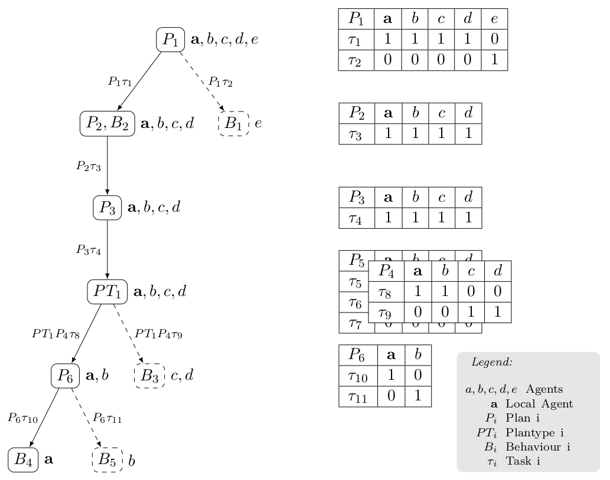
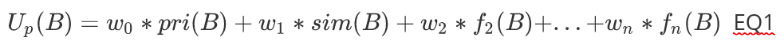

# Task Allocation
The Task Allocation handles the assignment of tasks to agents if a state is entered or some failure occurred during the execution of a plan. There are different classes of task allocation problems, differing with regard to the number of tasks an agent can be assigned to, the number of agents a task can be assigned to, and the duration for which the task assignment lasts. In the case of the ALICA Framework, the task allocation problem is categorised as a multi-task (MT), multi-robot (MR), and instantaneous assignment (IA) problem [1] that is considered as an NP-hard problem.

*Figure 1: Example of a Recursive Task Allocation*

The task allocation problem in ALICA is defined as an optimal assignment problem of agents to tasks. Figure 1 illustrates an example instance of this problem. Plan P1 is the top-level plan and the agents a, b, c, d, e need to be assigned recursively to tasks in the given plan hierarchy. An assignment for one plan is represented as a table, or stack of tables in case of plantypes, where each column corresponds to an agent and each row corresponds to a task in the plan. 1 means the agent is assigned to the task in that row, and 0 means it is not. A valid task assignment only assigns one task per plan or plantype to an agent, i. e. each column includes only one 1. Agent a is the local agent that solves the task allocation problem and afterwards compares its result with the results from its teammates. In case of a conflict, the Conflict Handling module takes over and resolves the conflict. Apart from one task per agent, several other requirements need to be fulfilled for a task assignment of a plan to be valid. The precondition and the runtime condition of the plan must hold under the given task assignment, the minimum cardinality of each task must be fulfilled, and it must be allowed for the role of each agent to execute its assigned task. In Figure 1, the dashed branches of the plan hierarchy are not calculated by the local agent a because it is not assigned to the corresponding tasks.

In order to find the optimal assignment of tasks to agents, in ALICA an A* search algorithm evaluates the utility function of each plan. The utility functions are of the form

and include at least the priority summand and the similarity summand. The priority summand considers the aptitude of roles for certain tasks and the similarity summand prioritises task assignments that are similar to currently existing assignments, in order to avoid too many fluctuations in the assignments. The other summands are considered domain-dependent and can be designed to add arbitrary criteria. The A* algorithm is recursively triggered for each hierarchy level along the branch of the local agent. According to the assigned tasks, the amount of agents to be assigned is reduced on each level, and the algorithm terminates if it reaches a leaf of the plan hierarchy. In case it is not possible to find a valid task assignment at a certain level, the algorithm tracks back its search and evaluates the next best assignment on the level before.

As the domain-dependent summands of the plans utility functions often consider sensor values that differ between the agents of the team, it can happen that some agents consistently calculate a different solution for the same task allocation problem. In this case, the Conflict Handling module detects the conflict, identifies the involved agents and, e. g., overwrites the different solutions with the solution of the agent with the lowest ID.

[1] A. Khamis, A. Hussein and A. Elmogy. ‘Multi-Robot Task Allocation: A Review of the State-of-the-Art’. In: Cooperative Robots and Sensor Networks 2015. Vol. 604, pp. 31–51

**NAV**  *top: [Overview](../README.md)* *next: [Conflict Resolution](conflict_resolution.md)*

