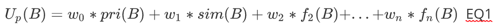

# Utility Functions
A utility function represents criteria according to which a [plan](plans.md) is more or less suitable for a certain situation in the environment. $U_p(B)$ is the utility function of plan $p$ parametrised with the believe base $B$. A believe base of an agent can include everything that it believes about its domain and current situation, as well as everything that it believes about the current execution state of the running ALICA program. However, a utility function may only refer to parts of the ALICA program that belong to the plan $p$, in order to fulfil the locality principle which guarantees the scalability of ALICA programs at runtime. 

Utility functions are evaluated at runtime, in order to choose the best plan from a plantype and choose the best assignment of tasks to agents. Therefore,  the input for a utility function, i. e. the believe base B, always includes the current or a potential assignment of tasks to robots for the plan $p$.

A utility function has always the following form:

A utility function, as given in Equation (1), is a weighted sum of functions. The weights are constants between 0 and 1 that sum up to 1. 

**The functions represent independent criteria how suitable the plan is for the current situation.** A utility function includes the priority function $pri(B)$ and the similarity function $sim(B)$ by default, but their weights can be set to 0 and the similarity function is only evaluated if the ALICA engine compares and old with a potential assignment of tasks to agents (see Similarity Function below).

## Role-Task Priority Function

The priority function $pri(B)$ evaluates the assignment of [tasks](tasks.md) to agents for plan $p$ according to the preferences of the agents' roles. An agent that has a *transporter* role, for example, is well suited for the *transport* task. How much which role prioritises which task is defined by each [role](roles.md) itself. 

The priorities must be between 0 and 1. The (role, task, priority) triple (R,T,0), for example, means that assigning the task T to an agent with role R does not add any benefit for achieving the goal of a plan. However, (R,T,1) would mean that assigning task T to an agent with role R does contribute the best possible benefit for achieving the goal of a plan.

It is also possible to define a negative priority, i.e. (R,T,X<0). A negative priority means that it is forbidden to assign task T to an agent with role R. The absolute  value of the negative priority does not mean anything, all negative values mean the same.

## Similarity Function

The similarity function $sim(B)$ evaluates how similar two assignments of tasks to agents for plan $p$ are. The purpose of the similarity function is to converge the assignment of tasks to agents at runtime for the whole team of agents.

While the task assignment algorithm is searching for a potentially better assignment then the current one, the similarity function increases the utility of possible assignments that are most similar to the existing one. That way an agent does not get assigned a new task just because it does not matter what task it is executing.

Please note, that the similarity function is only evaluated when the ALICA engine tries to find a better task assignment, but not if there is no existing task assignment.

## Custom Functions

Like the priority function and the similarity function, custom functions have to return an arbitrary negative value, or a value between 0 and 1 when they are evaluated. Other than that, there is no restriction for custom functions. Only keep in mind that evaluating custom functions should be efficient, since the evaluation can be done several hundred or thousand times per search for the best task assignment.

Details about the task assignment algorithm are given in the [Task Allocation](./task_allocation.md) article.

**NAV** *prev: [Plantypes](plantypes.md)*  *top: [Overview](../README.md)* *next: [Roles](roles.md)*

