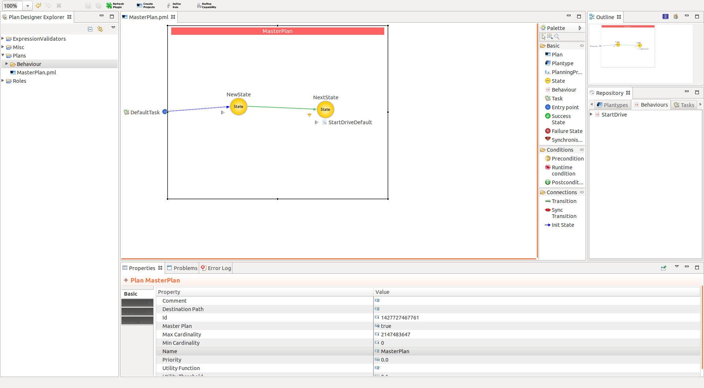

#Autogen code

###First of all, please write your code in PROTECTED REGIONS. This ensures that your code is not deleted when you generate new again.

**Used Plan**

**Explanation of Plan code**
* [Plan code](Plancode.md)

**Explanation of Plan constraint code**
* [PlanConstrain code](PlanConstraintCode.md)

**Explanation of Behavoiur code**
* [Behaviour code](BehCode.md)

**Explanation of Domain Behaviour**
* [DomainBehaviour code](Domain.md)
