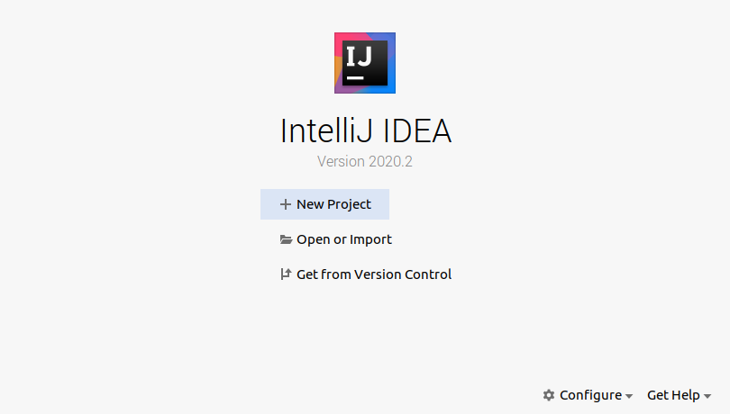
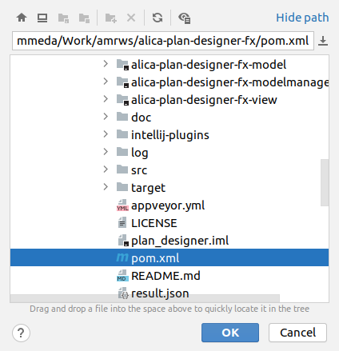
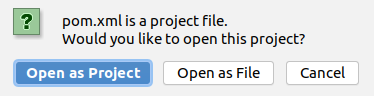
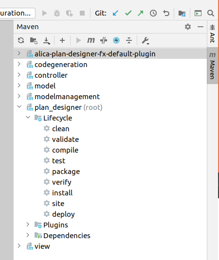
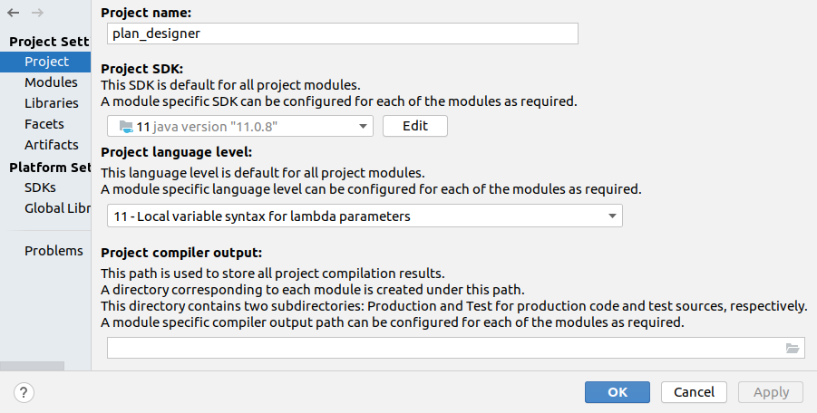
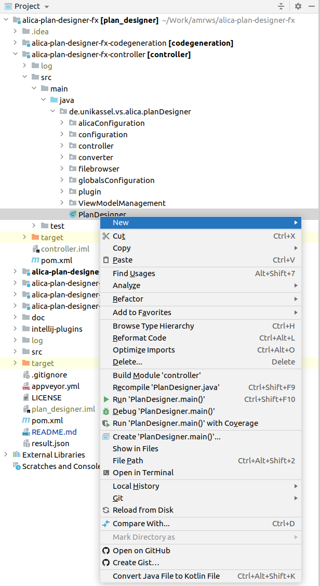

# Setup Intellij

1. Please download and install/unpack the most current version of the [Intellij Community Edition](https://www.jetbrains.com/idea/download/) and checkout the [Plan Designer repository](https://github.com/rapyuta-robotics/alica-plan-designer-fx) to your local filesystem.

2. Start Intellij either via the application launcher of your operating system or via a terminal (`$ ./bin/idea.sh`)

3. Choose "Open or Import":

   

4. Select the pom.xml file in the root directory of the repository and press OK:

   

5. Choose "open as project" in the next pop-up window. This will create a .idea folder in the root directory of the Plan Designer repository, but no worries, git ignores it due to some entry in the .gitignore file of the repository. However, if you ever want to cleanly setup Intellij's project of the Plan Designer again, you can simply delete this folder.

   

6. Intellij will open and starts to assess the Plan Designer project. Wait until Intellij got sorted itself and the project structure pops up nicely. The progress bar of Intellij is in the lower bar of the IDE window at the right end, you can oversee it quit easily. When it is done, the progress bar vanishes. Intellij will automatically download the first dependencies that are mentioned in the pom.xml files of the different components of the Plan Designer and put it into your local Maven repository, which is the .m2 folder in your home directory.

7. Open the Maven menu and prepare the compilation by

   1. deactivating tests (round circle with flash in it),
   2. clicking the first button (circular arrows),
   3. and clicking the second button (folder with circular arrows).

   This again can take a while, because it might trigger Intellij to download dependencies, that it did not download, yet.

   

8. Compile the Plan Designer by double click on "install" in the Maven menu under plan_designer->Lifecycle. This step is most likely to fail, if something was not setup correctly in the former steps. For example, Intellij might not be configured to use OpenJDK 11. You can check this by clicking on "Project Structure" in the File menu of Intellij.

   

   It might be, that you need to add OpenJDK11 as SDK in the Plattform Settings->SDKs section.

9. Compile the Default Plugin for the code generation by double click on "install"in the Maven menu 
   under alica-plan-designer-fx-default-plugin->Lifecycle.

10. If everything did go fine, you should be able to right-click on the class **de.unikassel.vs.alica.planDesigner.PlanDesigner** inside the **controller** module under src/main/java/de.unikassel.vs.alica.planDesigner and choose "Debug 'PlanDesigner.main()'" from the context menu, in order to start the Plan Designer. Once this is done, next time you can simply hit the green bug-button top right in Intellij.

    

    If your context menu does not show such an entry and the symbol of the PlanDesigner file is not as shown above, something is wrong with your Intellij setup. Please revise, whether you followed the instructions strictly. Especially a wrong Java version will forbid Intellij to recognise the Plan Designer project correctly.