# The ALICA Designer runtime

## 1 How to start the plan designer?

- To run the designer use the docker-compose.yml file in
supplementary/alica_designer_runtime/:

  `$ docker-compose up`

- The designer is web based & runs in the browser. After executing the above command,
navigate to http://localhost:3030/ to run the designer.
- When you start the plan designer for the first time, it should look like this:

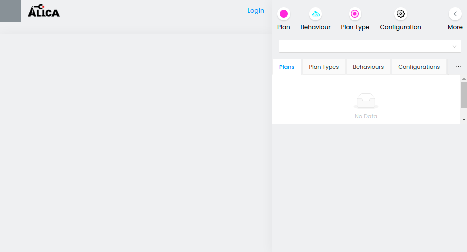

## 2 Overview

### 2.1 Settings
In the top left corner of the plan designer you can see a plus symbol.
Clicking on that symbol shows the Settings menu.

- **Github Application ID** - See [github-worklow setup](#320-setup) for more info
- **Backend URL** - The URL where backend webserver is running.
- **Live Debugging Websocket URL** - The URL where backend websocket is running.

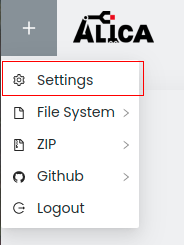

### 2.2 Import and export menu
In the top left corner of the plan designer you can see a plus symbol.
Clicking on that symbol opens the import and export menu of the plan designer.

- File System
  - File System Import: Import your plans from a local filesystem directory.
  - File System Export: Export your plans to a local filesystem directory.
- Zip
  - Zip Import: Import your local plans from a zip file.
  - Zip Export: Export your plans locally, starts the download of a zip file.
- Github
  - Git Import: Import your plans from a branch of a git repository of your choice.
  - Git Export: Export your plans to a branch of a git repository of your choice.
- Logout: Log out from your GitHub account.

A more detailed description of how the import and export process works can be found in
[3 How to import and export plans?](#3-how-to-import-and-export-plans)

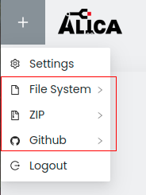

### 2.3 Login button

Pressing the login button will open the login page of the plan designer.

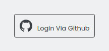

At the center of the page you can see the "Login Via Github" button. If you have not used the plan designer
with your GitHub account yet, you will be asked to give permissions to the plan designer to
access your repositories. This is necessary for the GitHub import and export feature of the plan designer.

After logging in, the login button will be replaced with your GitHub username.

### 2.4 Create alica elements menu

In the top right corner of the plan designer sits a menu for creating plans and other elements.
Selecting an element (for example Plan) will open up a menu for creating that element. Pressing "More"
will open up the menu and reveal the options to create Tasks and Roles.

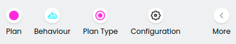

You can create the following elements:

- Plan
- Behaviour
- Plan Type
- Configuration
- Task & Task Repository
- Role & Role Repository

#### 2.4.1 Plan
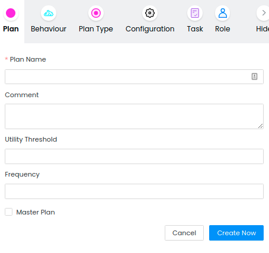

- Utility Threshold: A utility of an assignment needs an increase of at least the threshold value
compared to the current assignment's utility before the assignment of an agent is replaced.
- Frequency: Sets the number of executions of the plan's run method per second.
- Master Plan: Check that box if you want to use the plan as a Master Plan for your agent.

#### 2.4.2 Behaviour
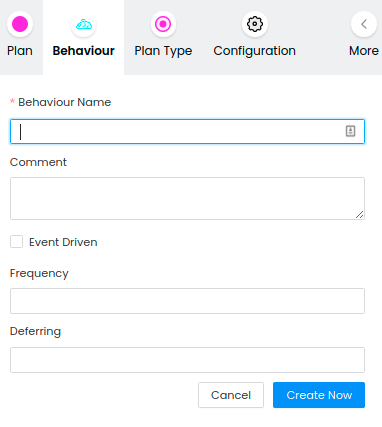
- Event Driven: Check that box if you prefer to execute the run method of the behaviour manually
instead of executing it with a fixed frequency per second.
- Frequency: Sets the number of executions of the behaviour's run method per second.
- Deferring: Initial delay in ms before executing the behaviours run method the first time.

#### 2.4.2 Task & TaskRepository
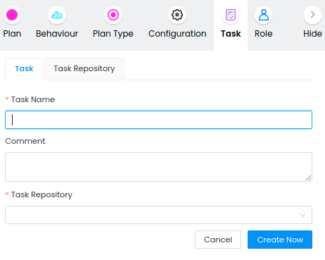

- Task Repository: Select the repository in which the new task should be stored.

You can create a TaskRepository by switching the tab from "Task" to "Task Repository".

#### 2.4.3 Role & RoleSet
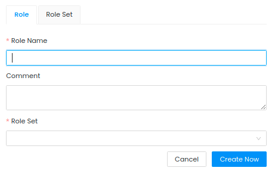

- Role Set: Select the RoleSet in which the new role should be stored.

You can create a RoleSet by switching the tab from "Role" to "Role Set".


- Default Priority: When a role of this roleset does not have a priority set for a task, this value
will be used as its priority.
- Default Role Set: Check this box to use this RoleSet as your default one.

#### 2.4.4 Plan Type, Configuration & TaskRepository
For the remaining elements of plans you only need to provide a name.

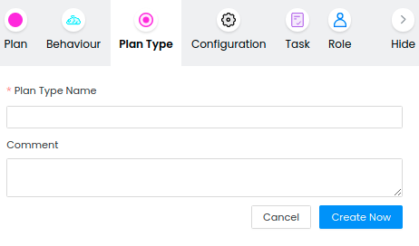

### 2.5 Selection menu
In the selection menu you can select one of your previously created elements.

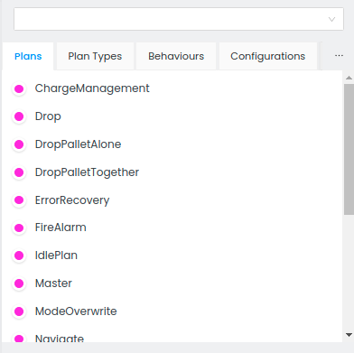

You can choose a type of element (for example "Plans") by switching to the corresponding tab.
By clicking on the ellipsis button you can choose to switch to a tab of one of the currently not
visible elements.

At the top of the selection menu you can search for an element of any type by name.

### 2.6 Element settings menu
Selecting an element in the selection menu (see 2.4) will open its settings menu right below the
selection menu. Here you can adjust settings for each element of your plan.

For all elements you will see the id at the top of the settings menu. To the right of the id
is a button for copying the id to your clipboard.

#### 2.6.1 Properties

In the properties tab you can adjust general properties of an element. The selection of properties
you can change differ between the element types.

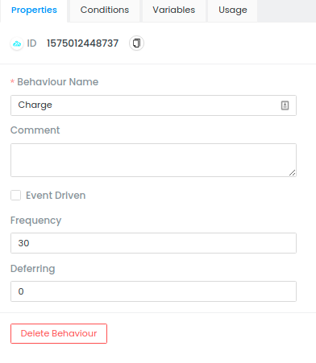

#### 2.6.2 Conditions
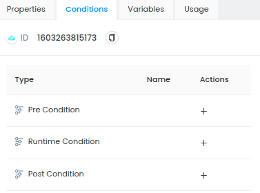

In the conditions tab you can add Pre Conditions, Runtime Conditions and Post Conditions. Not
all element types support all conditions.

To add a condition, click on the plus symbol in the column "Actions". This will open a
window for creating a condition at the center of the plan designer.

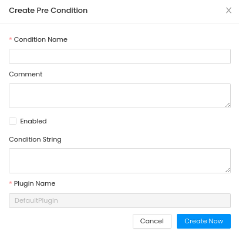

To learn more about conditions, have a look at the
[documentation](https://rapyuta-robotics.github.io/alica/articles/conditions.html).

#### 2.6.3 Variables
In the variables tab you can add variables to your element's conditions.

To learn more about variables, have a look at the
[documentation](https://rapyuta-robotics.github.io/alica/articles/variables.html).

#### 2.6.4 Usage
The usage tab shows you in which plans your selected element is used. Clicking on an entry in the
list of usages will open the plan.

#### 2.6.5 Plans
You can apply plans to a PlanType in the "Plans" tab. Click on "Apply Plan" and select a plan from
the list. You can click on the switch in the column "Active" to deactivate an active plan
or activate a deactivated one in the PlanType without deleting it.

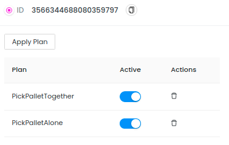

#### 2.6.6 Variable Bindings
You can create variable bindings for PlanTypes by clicking on "Add Variable Binding".

This will open a window at the center of the plan designer.

To learn more about variable bindings, have a look at the
[documentation](https://rapyuta-robotics.github.io/alica/articles/variables.html).

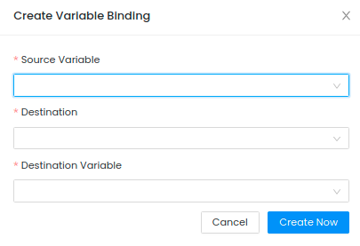

#### 2.6.7 Parameters
You can set parameters for configurations. Click on "Apply Configuration Parameter" to create
a parameter with name and value.

To learn more about configurations and parameters, have a look at the
[documentation](https://rapyuta-robotics.github.io/alica/articles/configurations.html).

#### 2.6.8 Roles
In the roles tab of a RoleSet you can add new roles to the roleset and remove existing ones.
Clicking on the edit button of a role will open its properties tab.

#### 2.6.9 Task Priorities
You can set task priorities for a role by clicking on "Apply Task Priority", selecting a task
and setting a value for priority.

### 2.7 Create Plan Space

The plan designer has an empty space in which you can create your plans. Selecting a plan in the
selection menu will show the structure of the plan in the plan space.

On the left side of the plan designer you can see a list of tools you can use to create your plan.

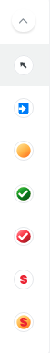

From top to bottom these tools are:
  - Selection Tool
  - Entry Point Tool
  - State Tool
  - Success State Tool
  - Failure State Tool
  - Synchronization Tool
  - Transition Synchronization Tool

### 2.7.1 Entry Points
Select the entry point tool symbol and click somewhere in the plan space. This will open a
window for creating your entry point.

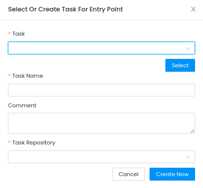

You can either select a task or create a new one.

After creating the entry point it will be visible in the plan space. You can select it
with the selection tool and adjust its properties in the properties tab.

To learn more about entry points have a look at the
[documentation](https://rapyuta-robotics.github.io/alica/articles/entrypoints.html).

### 2.7.2 States

You can place states by selecting either the state, failure state or success state tool.
Then click somewhere in the plan space to place your state. Select the state with the
selection tool to open the properties tab of the state.

To learn more about states have a look at the
[documentation](https://rapyuta-robotics.github.io/alica/articles/finite-state_machines.html).

### 2.7.3 Transitions

Choose the selection tool and hover with your cursor on the source state / entry point.
Move your cursor to the circle appearing at the top of the state / entry point. Drag and
drop your cursor to your destination node. Wait with dropping until a circle appears on top
of your destination node and drop in the middle of that circle.

Click on a transition with the selection tool to adjust properties and precondition
of a transition. A connection from an entry point to a state does not have a precondition.

To learn more about transitions have a look at the
[documentation](https://rapyuta-robotics.github.io/alica/articles/finite-state_machines.html).

### 2.7.4 Synchronization

Select the synchronization tool and place a synchronization node in the plan space.
Select the transition synchronization tool and place it in the plan space.

Connect the synchronization node with the transition synchronization node.

You can synchronize transitions by creating a connection from the source node to the
transition synchronization node. Then create a transition from the transition synchronization
node to the target node.

To learn more about synchronization, have a look at the
[documentation](https://rapyuta-robotics.github.io/alica/articles/synchronisations.html).

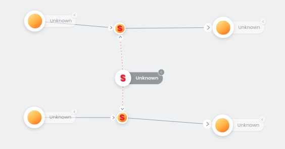

### 2.7.5 Add behaviours, configurations, plan types and plans

To add a behaviour / configuration / plan type / plan to a state, drag and drop it from
the selection menu to a state of your choice.

### 2.7.6 Delete parts of your plan

You can delete parts of your plan by selecting the node / transition with the selection
tool and hitting the delete key on your keyboard.

You can remove behaviours / configurations / plan types / plans from a state by hovering
over the element you want to remove and clicking on the "X".

## 3 How to import and export plans?

The plan designer supports three ways of importing and exporting plans:
- Using native filesystem (only with NATIVE_MODE)
- Using zip files
- Using a GitHub repository

### 3.1 FileSystem-Workflow

The web-plan-designer provides the capability to import and export plans directly from and to the local filesystem on the host where the web designer is running.

To do this, the following environment variables must be set at launch time
- `NATIVE_MODE` must be set to `true`(default). [See here](https://github.com/rapyuta-robotics/alica/tree/rr-devel/supplementary/alica_designer_runtime/docker-compose.yml#L33)
- `NATIVE_IMPORT_EXPORT_PATH` should be set to the filesystem path where the import/export takes place [See here](https://github.com/rapyuta-robotics/alica/tree/rr-devel/supplementary/alica_designer_runtime/docker-compose.yml#L38-L39)

#### 3.1.1 Export
Simply click on the ‘+’ button in the top left corner of the page, and then click on File System -> Export

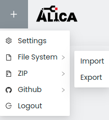

This will export the plans directly to the host's filesystem.

#### 3.1.2 Import
Same as export, but click on File System -> Import. This will import plans directly from the host's filesystem.

On successful import the plans should be visible in the right panel.

### 3.2 Zip-Workflow

The web-plan-designer provides the capability to export
your plans to a zip file, and also import plans from a zip file.

#### 3.2.1 Export
Simply click on the ‘+’ button in the top left corner of the page, and then click on Zip -> Export to Zip.

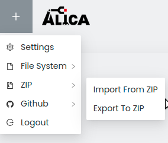

This will trigger a download of a zip file "web_designer_program.zip".
The zip file contains information about your created plans.

To use your alica plans in your project you have to
 - Extract the content of the zip file
 - Replace the content of your projects etc/ folder with the plans,
roles and tasks folder in web_designer_program/alica_program/

#### 3.2.2 Import
Same as export, but click on Zip -> Import from Zip, and select a zip file from your computer containing valid ALICA plan elements,
to import them to the web-designer. Usually this will be a zip file of your etc/ folder.

<span style="color:red">WARNING</span>: Import <span style="color:red">overwrites</span> anything
you’ve done on the web-designer, so make sure to export first, to save your data.

On successful import the plans should be visible in the right panel.

### 3.3 Git-Workflow
It is also possible to import plans from a remote GitHub repository,
as well as push changes back to the same repo, or any other, if explicitly specified.

To be able to use this, you first need to log in to your GitHub account from the
web-plan-designer. Use the Login button (see first image in this readme).
If you have not used the plan designer before, the application asks for access rights.

After logging in via GitHub you should be able to see additional options.

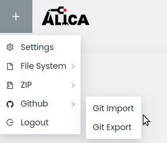

#### 3.3.0 Setup

To be able to login to github and use the Git-workflow to import and export plan, it is necessary to register the web-plan-designer application as an oauth2 client with github before launching the web-plan-designer.

1. Follow [Github's guide](https://docs.github.com/en/developers/apps/building-oauth-apps/creating-an-oauth-app) to create a new oauth application. Enter the URL of the plan designer (default: `http://localhost:3030/`) as the 'Homepage URL' and 'Authorization Callback URL'.

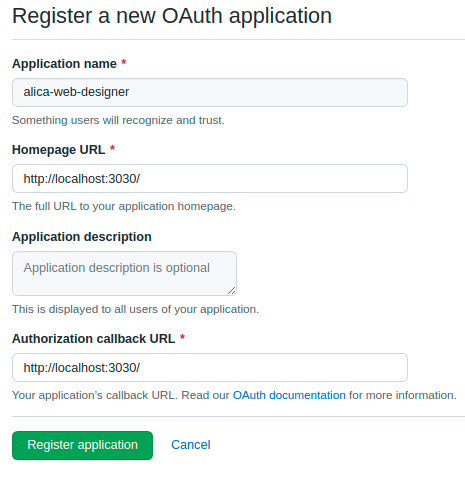

2. Note down the client ID and client secret after registering the application in the previous step.

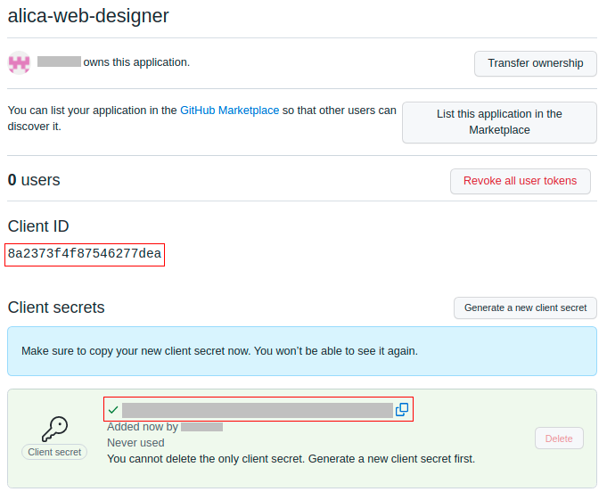

3. Set the client ID and client secret as environment variables before launching the web-plan-designer

```
    export SOCIAL_APP_CLIENT_ID=<client_id>
    export SOCIAL_APP_SECRET=<client_secret
```
4. Set the client ID in the web-plan-designer [settings](#21-settings) after launch

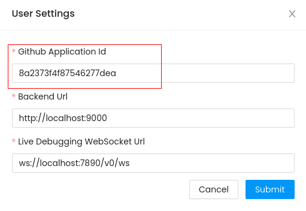


#### 3.3.1 Import

Click on ‘Github -> Git Import’, and you’ll see the following form.

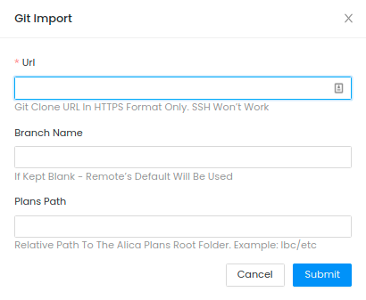

URL: Enter the git clone URL in https format only, ssh won’t work.

Branch Name: You can also enter a branch name, if kept blank, remote’s default will be used.

Plans Path: It is also recommended to provide the path to the plan elements (relative to repo root), in case your repo contains many different folders each organising an ALICA designer project.

E.g.  If your plans are in the lbc-repo , then the path for plans would be `lbc/etc`, since that’s where the plans are located remotely.

NOTE: If the repository contains duplicate plans, but in different sub paths of the repo, providing Plans Path is necessary or else, the import process will fail.

After a successful git-import the plans should be visible in the right panel as below. Here lbc plans have been downloaded as an example.

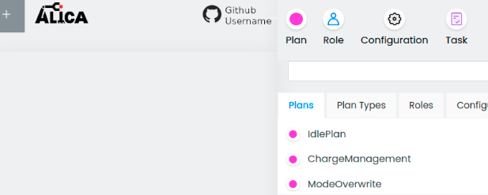

#### 3.3.2 Export

In the top left corner  ‘+’ -> GitHub -> Git Export
The following form will pop up:

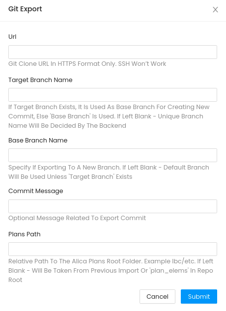

URL: Type in a git clone URL (https only).
URL can be left blank only if there was a previous import operation, in which case the git URL provided then will be used.

Target Branch Name: The branch to export to. If exists, it is used as the base branch for creating new commit, else 'Base Branch' (see below) is used. If left blank, a unique branch name will be decided by the backend.

Base Branch Name: Base branch on which new commit is made. Specify if exporting to a new branch. If left blank - Default branch of the repository will be used, unless 'Target Branch' exists.

Commit Message: Optional commit msg

Plans Path: The exact path (relative to repo root) where you want the plans to be available in the newly created branch after export.
If kept empty there are two possibilities for Plans Path:
Same as the Plans Path in the previous import operation.
If there was not any previous import operation the plans will be available inside the ‘plan_elems’ folder in repo root.

## 4 Code-Generation
To generate the source code you need to download
https://drive.google.com/file/d/1xAQ84NJSTOohR93QHBrysxz31v5sXZh2/view?usp=sharing &
extract the .zip archive into the supplementary/alica_designer_runtime folder.

After extracting the code generation you can use the generate.sh script to generate the
source code:

`$ ./generate.sh <path_to_folder_that_contains_etc>`

The source code generated by the script can be found in
<path_to_folder_that_contains_etc>/Expr.
