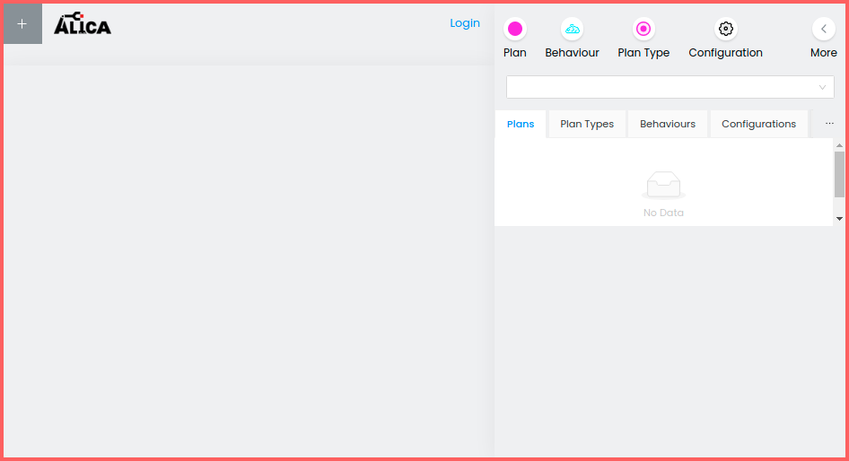

## 1. Introduction

The ALICA Designer is a web-based tool for creating and managing autonomous robot behaviors using the ALICA framework. This document provides a structured guide on using the ALICA Designer, including starting the application, configuring settings, importing and exporting plans, and working with various plan elements.

for more info about what are the components involved check this [docker compose file](../docker-compose.yml)

---

## 2. Starting the Plan Designer

To run the designer, use the provided shell script(make sure it is executable i.e it has enough permissions):

```sh
./run_designer.sh [start|reset|update]
```

- **start** - Starts the designer backend and UI.
- **reset** - Clears the database.
- **update** - Pulls newer images.

> **Note:** Launch-time configurations can be modified in [config.env](../config.env).

The designer runs in the browser. After executing the script, navigate to:

```
http://localhost:3030/
```

When started for the first time, it should appear as follows:



---
