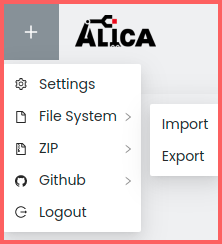
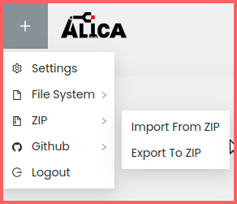
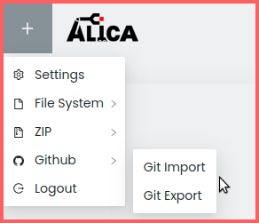
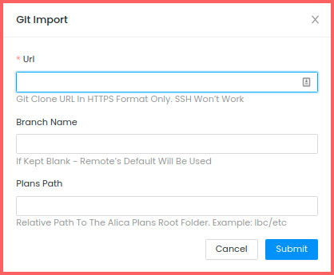
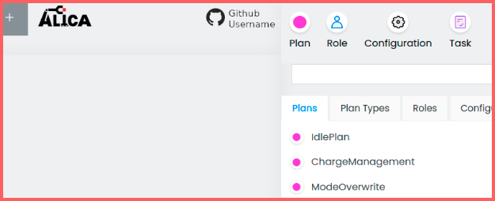
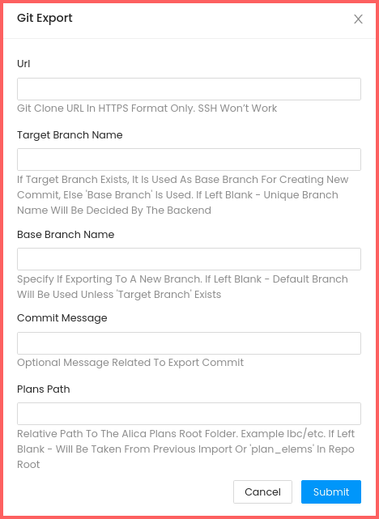

# How to import and export plans?

The plan designer supports three ways of importing and exporting plans:

1. Using native filesystem (only with NATIVE_MODE)
2. Using zip files
3. Using a GitHub repository

## 1. FileSystem-Workflow

The web-plan-designer allows you to import and export plans directly from and to the local filesystem on the host where the web designer is running.

To do this, set the following environment variables at launch time:

- `NATIVE_MODE` must be set to `true`. [See here](https://github.com/rapyuta-robotics/alica/blob/7ca145e25647a3a65a6e624c0ab8786d15198cf3/supplementary/alica_designer_runtime/config.env#L8)
- `NATIVE_IMPORT_EXPORT_PATH` should be set to the filesystem path where the import/export takes place. [See here](https://github.com/rapyuta-robotics/alica/blob/7ca145e25647a3a65a6e624c0ab8786d15198cf3/supplementary/alica_designer_runtime/config.env#L11)

### 1.a Export

Click on the ‘+’ button in the top left corner of the page, then click on File System -> Export.

This will export the plans directly to the host's filesystem.

### 1.b Import

Click on File System -> Import. This will import plans directly from the host's filesystem.

On successful import, the plans should be visible in the right panel.

## 2. Zip-Workflow

The web-plan-designer allows you to export your plans to a zip file and import plans from a zip file.

### 2.a Export

Click on the ‘+’ button in the top left corner of the page, then click on Zip -> Export to Zip.

This will trigger a download of a zip file named "web_designer_program.zip".
The zip file contains information about your created plans.

To use your ALICA plans in your project, you need to:

- Extract the content of the zip file.
- Replace the content of your project's `etc/` folder with the plans, roles, and tasks folders in `web_designer_program/alica_program/`.

### 2.b Import

Click on Zip -> Import from Zip, and select a zip file from your computer containing valid ALICA plan elements to import them to the web-designer. Usually, this will be a zip file of your `etc/` folder.

WARNING: Import overwrites anything you’ve done on the web-designer, so make sure to export first to save your data.

On successful import, the plans should be visible in the right panel.

## 3. Git-Workflow

You can import plans from a remote GitHub repository and push changes back to the same repo or any other, if explicitly specified.

First, set up the web-plan-designer application as an OAuth2 client with GitHub from [here](./setup.md).

Log in to your GitHub account from the web-plan-designer using the Login button (see the first image in this readme). If you have not used the plan designer before, the application will ask for access rights.

After logging in via GitHub, you should see additional options.

### 3.a Import

Click on ‘GitHub -> Git Import’, and you’ll see the following form.

- **URL**: Enter the git clone URL in HTTPS format only; SSH won’t work.
- **Branch Name**: You can also enter a branch name. If left blank, the remote’s default will be used.
- **Plans Path**: It is recommended to provide the path to the plan elements (relative to repo root) if your repo contains many different folders organizing an ALICA designer project.

For example, if your plans are in the `di_core` repo, the path for plans would be `robot/lbc/etc`, since that’s where the plans are located remotely.

**NOTE**: If the repository contains duplicate plans in different sub-paths, providing the Plans Path is necessary, or else the import process will fail.

After a successful git-import, the plans should be visible in the right panel as shown below. Here, lbc plans have been downloaded as an example.

### 3.b Export

Click on ‘+’ -> GitHub -> Git Export. The following form will pop up:

- **URL**: Type in a git clone URL (HTTPS only). The URL can be left blank only if there was a previous import operation, in which case the git URL provided then will be used.
- **Target Branch Name**: The branch to export to. If it exists, it is used as the base branch for creating a new commit; otherwise, the 'Base Branch' (see below) is used. If left blank, a unique branch name will be decided by the backend.
- **Base Branch Name**: The base branch on which the new commit is made. Specify if exporting to a new branch. If left blank, the default branch of the repository will be used unless 'Target Branch' exists.
- **Commit Message**: Optional commit message.
- **Plans Path**: The exact path (relative to repo root) where you want the plans to be available in the newly created branch after export. If kept empty, there are two possibilities for Plans Path:
  - Same as the Plans Path in the previous import operation.
  - If there was no previous import operation, the plans will be available inside the ‘plan_elems’ folder in the repo root.
