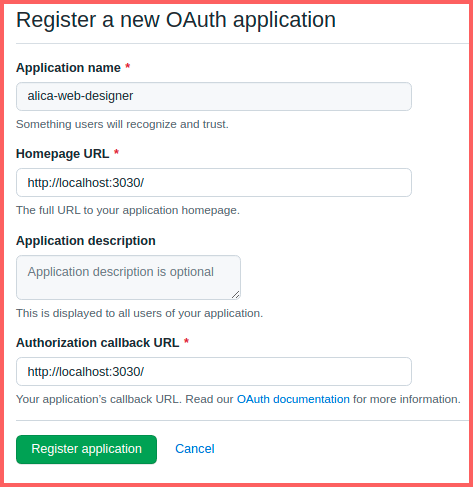
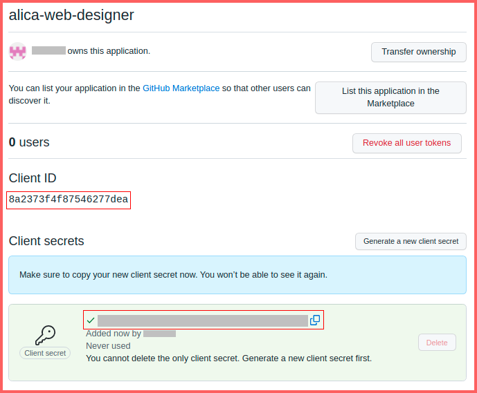
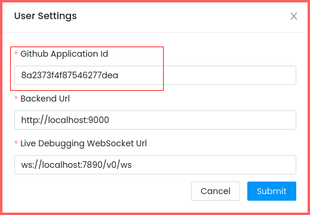
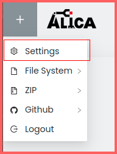
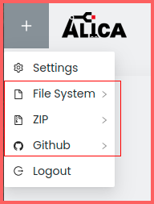
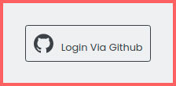

# Setup

To be able to login to github and use the Git-workflow to import and export plan, it is necessary to register the web-plan-designer application as an oauth2 client with github before launching the web-plan-designer.

1.Follow [Github's guide](https://docs.github.com/en/developers/apps/building-oauth-apps/creating-an-oauth-app) to create a new oauth application. Enter the URL of the plan designer (default: `http://localhost:3030/`) as the 'Homepage URL' and 'Authorization Callback URL'.




2.Note down the client ID and client secret after registering the application in the previous step.



3.Set the client ID and client secret as environment variables before launching the web-plan-designer

```
    export SOCIAL_APP_CLIENT_ID=<client_id>
    export SOCIAL_APP_SECRET=<client_secret
```

This can also be set in `config.env`

4.Set the client ID in the web-plan-designer [settings](./usage-guide.md) after launch




## 1. Settings

In the top left corner of the plan designer, you can see a plus symbol. Clicking on that symbol shows the Settings menu.

- **GitHub Application ID**: See [GitHub workflow setup](./setup.md) for more info.
- **Backend URL**: The URL where the backend web server is running.
- **Live Debugging WebSocket URL**: The URL where the backend WebSocket is running.

  


## 2. Import and export menu

In the top left corner of the plan designer you can see a plus symbol.
Clicking on that symbol opens the import and export menu of the plan designer.

- File System
  - File System Import: Import your plans from a local filesystem directory.
  - File System Export: Export your plans to a local filesystem directory.
- Zip
  - Zip Import: Import your local plans from a zip file.
  - Zip Export: Export your plans locally, starts the download of a zip file.
- Github
  - Git Import: Import your plans from a branch of a git repository of your choice.
  - Git Export: Export your plans to a branch of a git repository of your choice.
- Logout: Log out from your GitHub account.

A more detailed description of how the import and export process works can be found in
[How to import and export plans?](#3import-and-export.md)



## 3. Login button

Pressing the login button will open the login page of the plan designer.



At the center of the page you can see the "Login Via Github" button. If you have not used the plan designer
with your GitHub account yet, you will be asked to give permissions to the plan designer to
access your repositories. This is necessary for the GitHub import and export feature of the plan designer.

After logging in, the login button will be replaced with your GitHub username.