# Usage

## 3. alica elements menu

In the top right corner of the plan designer sits a menu for creating plans and other elements.
Selecting an element (for example Plan) will open up a menu for creating that element. Pressing "More"
will open up the menu and reveal the options to create Tasks and Roles.

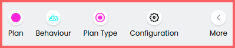

You can create the following elements:

- Plan
- Behaviour
- Plan Type
- Configuration
- Task & Task Repository
- Role & Role Repository
- Conditions

### 3.1 Plan

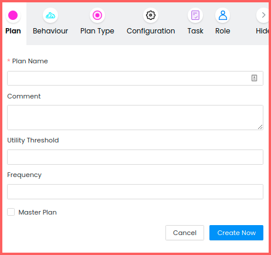

- Utility Threshold: A utility of an assignment needs an increase of at least the threshold value
  compared to the current assignment's utility before the assignment of an agent is replaced.
- Frequency: Sets the number of executions of the plan's run method per second.
- Master Plan: Check that box if you want to use the plan as a Master Plan for your agent.

### 3.2 Behaviour

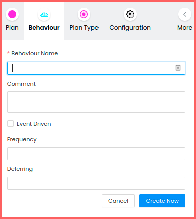

- Event Driven: Check that box if you prefer to execute the run method of the behaviour manually
  instead of executing it with a fixed frequency per second.
- Frequency: Sets the number of executions of the behaviour's run method per second.
- Deferring: Initial delay in ms before executing the behaviours run method the first time.

### 3.3 Task & TaskRepository

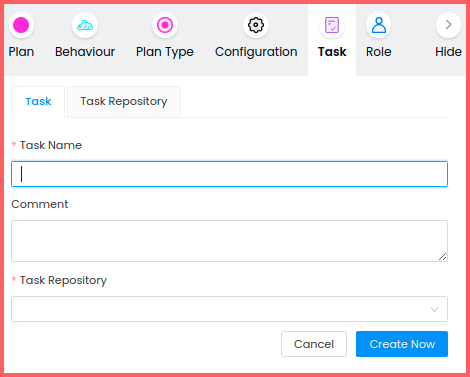

- Task Repository: Select the repository in which the new task should be stored.

You can create a TaskRepository by switching the tab from "Task" to "Task Repository".

### 3.4 Role & RoleSet

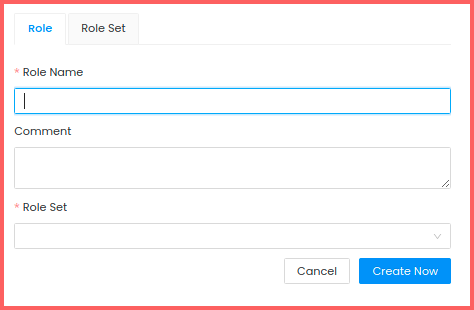

- Role Set: Select the RoleSet in which the new role should be stored.

You can create a RoleSet by switching the tab from "Role" to "Role Set".

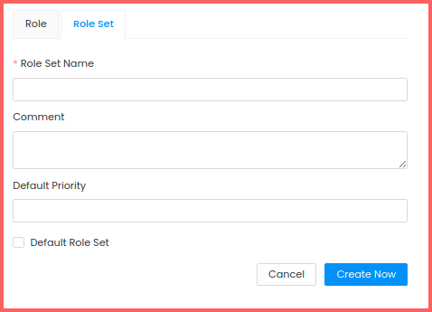

- Default Priority: When a role of this roleset does not have a priority set for a task, this value
  will be used as its priority.
- Default Role Set: Check this box to use this RoleSet as your default one.

### 3.5 Plan Type, Configuration, TaskRepository & Conditions

For the remaining elements of plans you only need to provide a name.

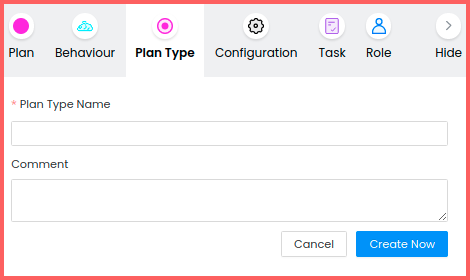

## 4.Selection menu

In the selection menu you can select one of your previously created elements.

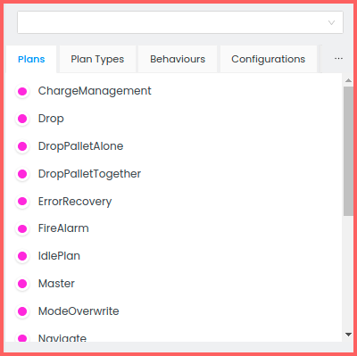

You can choose a type of element (for example "Plans") by switching to the corresponding tab.
By clicking on the ellipsis button you can choose to switch to a tab of one of the currently not
visible elements.

At the top of the selection menu you can search for an element of any type by name.

## 5. Element settings menu

Selecting an element in the selection menu (see 2.4) will open its settings menu right below the
selection menu. Here you can adjust settings for each element of your plan.

For all elements you will see the id at the top of the settings menu. To the right of the id
is a button for copying the id to your clipboard.

#### 5.1 Properties

In the properties tab you can adjust general properties of an element. The selection of properties
you can change differ between the element types.

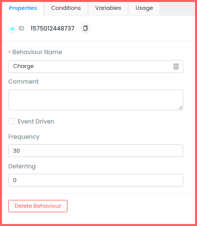

#### 5.2 Conditions

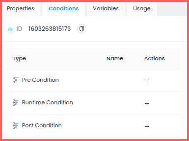

In the conditions tab you can add Pre Conditions, Runtime Conditions and Post Conditions. Not
all element types support all conditions.

To add a condition, click on the plus symbol in the column "Actions". This will open a
window for creating a condition at the center of the plan designer.

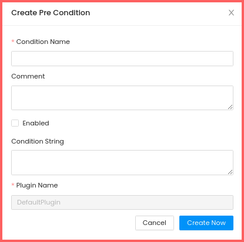

To learn more about conditions, have a look at the
[documentation](https://rapyuta-robotics.github.io/alica/articles/conditions.html).

#### 5.3 Variables

In the variables tab you can add variables to your element's conditions.

To learn more about variables, have a look at the
[documentation](https://rapyuta-robotics.github.io/alica/articles/variables.html).

#### 5.4 Usage

The usage tab shows you in which plans your selected element is used. Clicking on an entry in the
list of usages will open the plan.

#### 5.5 Plans

You can apply plans to a PlanType in the "Plans" tab. Click on "Apply Plan" and select a plan from
the list. You can click on the switch in the column "Active" to deactivate an active plan
or activate a deactivated one in the PlanType without deleting it.

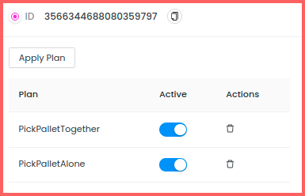

#### 5.6 Variable Bindings

You can create variable bindings for PlanTypes by clicking on "Add Variable Binding".

This will open a window at the center of the plan designer.

To learn more about variable bindings, have a look at the
[documentation](https://rapyuta-robotics.github.io/alica/articles/variables.html).

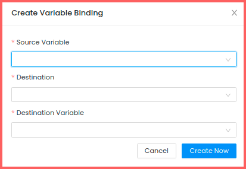

#### 5.7 Parameters

You can set parameters for configurations. Click on "Apply Configuration Parameter" to create
a parameter with name and value.

To learn more about configurations and parameters, have a look at the
[documentation](https://rapyuta-robotics.github.io/alica/articles/configurations.html).

#### 5.8 Roles

In the roles tab of a RoleSet you can add new roles to the roleset and remove existing ones.
Clicking on the edit button of a role will open its properties tab.

#### 5.9 Task Priorities

You can set task priorities for a role by clicking on "Apply Task Priority", selecting a task
and setting a value for priority.

#### 5.10 Blackboard

In the blackboard tab you can setup the blackboard of an element. By clicking on "Setup Blackboard", you can
add items to the blackboard and set their keys.
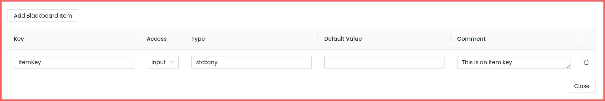

## 6 Create Plan Space

The plan designer has an empty space in which you can create your plans. Selecting a plan in the
selection menu will show the structure of the plan in the plan space.

On the left side of the plan designer you can see a list of tools you can use to create your plan.

From top to bottom these tools are:

- Selection Tool
- Entry Point Tool
- State Tool
- Success State Tool
- Failure State Tool
- Synchronization Tool
- Transition Synchronization Tool

### 6.1 Entry Points

Select the entry point tool symbol and click somewhere in the plan space. This will open a
window for creating your entry point.

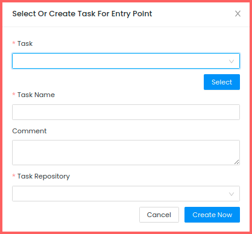

You can either select a task or create a new one.

After creating the entry point it will be visible in the plan space. You can select it
with the selection tool and adjust its properties in the properties tab.

To learn more about entry points have a look at the
[documentation](https://rapyuta-robotics.github.io/alica/articles/entrypoints.html).

### 6.2 States

You can place states by selecting either the state, failure state or success state tool.
Then click somewhere in the plan space to place your state. Select the state with the
selection tool to open the properties tab of the state.

To learn more about states have a look at the
[documentation](https://rapyuta-robotics.github.io/alica/articles/finite-state_machines.html).

### 6.3 Transitions

Choose the selection tool and hover with your cursor on the source state / entry point.
Move your cursor to the circle appearing at the top of the state / entry point. Drag and
drop your cursor to your destination node. Wait with dropping until a circle appears on top
of your destination node and drop in the middle of that circle.

By default, the condition "Default Condition" will be attached to the transition. You can select a condition in the selection menu and attach it to a transition with drag & drop.

Click on a transition with the selection tool to adjust properties and blackboard
of a transition. A connection from an entry point to a state does not have a transition condition.

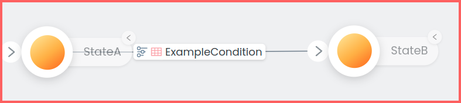

If a transition condition has a red grid, it means that the blackboard items of the condition are not fully mapped. By clicking on the red grid, you can setup the key mapping between the condition and the current plan.

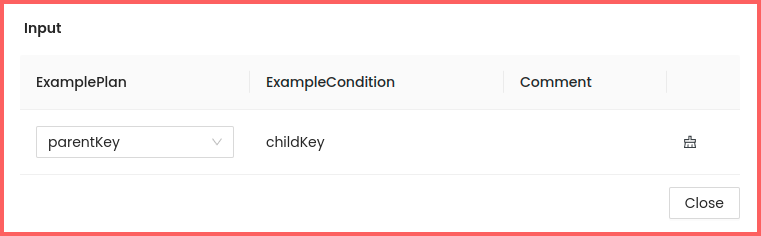

To learn more about transitions have a look at the
[documentation](https://rapyuta-robotics.github.io/alica/articles/finite-state_machines.html).

### 6.4 Synchronization

Select the synchronization tool and place a synchronization node in the plan space.
Select the transition synchronization tool and place it in the plan space.

Connect the synchronization node with the transition synchronization node.

You can synchronize transitions by creating a connection from the source node to the
transition synchronization node. Then create a transition from the transition synchronization
node to the target node.

To learn more about synchronization, have a look at the
[documentation](https://rapyuta-robotics.github.io/alica/articles/synchronisations.html).

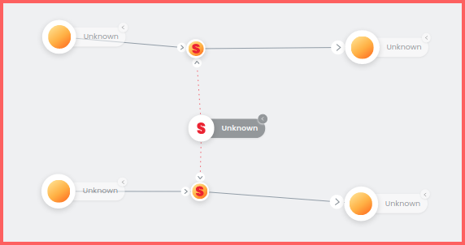

### 6.5 Add behaviours, configurations, plan types and plans

To add a behaviour / configuration / plan type / plan to a state, drag and drop it from
the selection menu to a state of your choice.

### 6.6 Delete parts of your plan

You can delete parts of your plan by selecting the node / transition with the selection
tool and hitting the delete key on your keyboard.

You can remove behaviours / configurations / plan types / plans from a state by hovering
over the element you want to remove and clicking on the "X".

