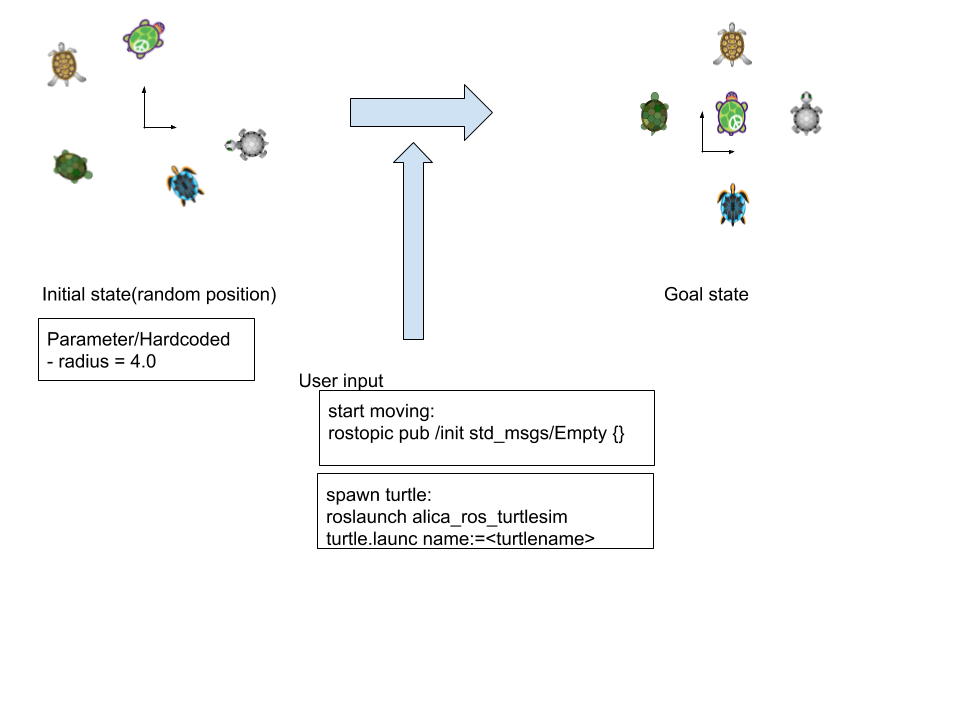
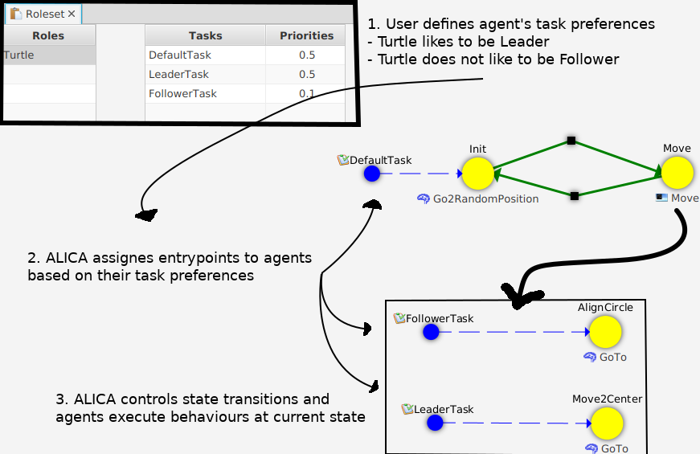
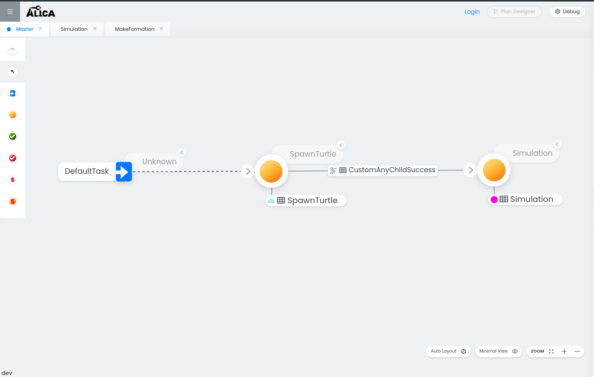
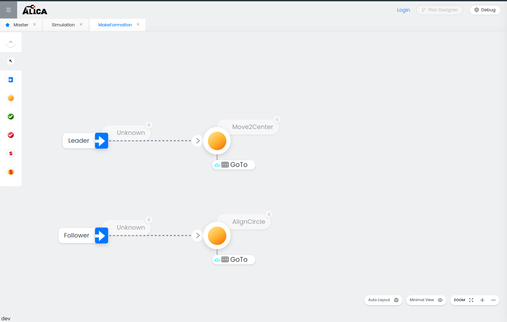
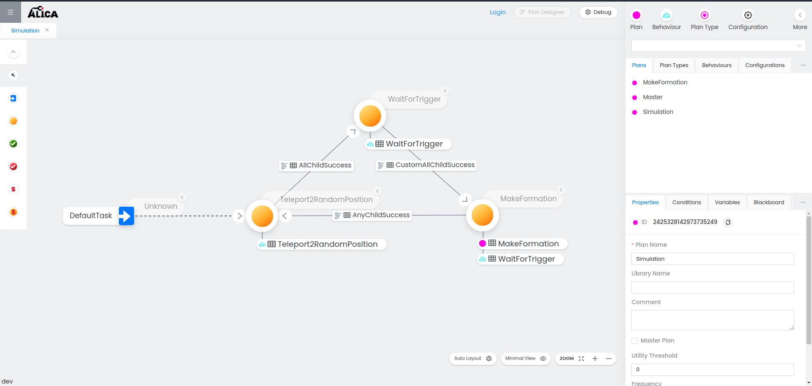
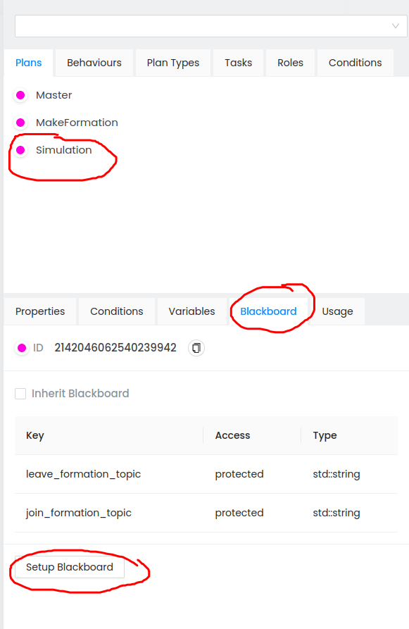
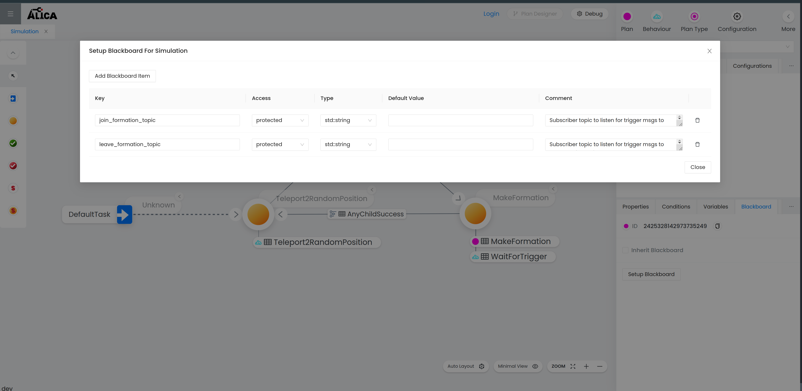
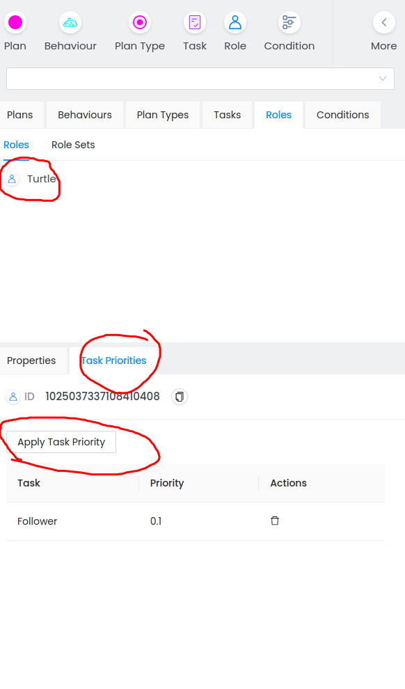

# Turtlesim Tutorial

## 1. Overview

This tutorial is an extension of the [turtlesim ROS package](http://wiki.ros.org/turtlesim). By following this tutorial, you will learn

- some of the core concepts of the ALICA language
- how to achieve multi-agent collaboration with the ALICA framework

In this tutorial, you will create an application as shown in the picture below. The ALICA engine will assign the `Leader` task to one turtle and the `Follower` task to the other turtles. Further, the ALICA engine will move the turtles to their goal positions based on distance constraints.



## 2. Prerequisite

You need to be familiar with following topics and tools:

- [ROS Noetic](http://wiki.ros.org/noetic/Installation/Ubuntu)
- [catkin_tools](https://catkin-tools.readthedocs.io/en/latest/installing.html)

## 3. The ALICA Language - Basics and Core Concepts

We will only give you a brief explanation on the ALICA core concepts. For the interested reader, we recommend to consider the [documentation](https://rapyuta-robotics.github.io/alica/) of the ALICA framework for more detailed information.

### Plan

A plan is a state machine in tree structure. Plans can include plans and states and each state can include `Behaviour`s. The ALICA engine assigns entrypoints of the plan tree to the agents, e.g., robots based on `Role`, `Task`, `Constraints` and `Utility function`.
The ALICA engine manages state transitions based on the developers code. The developer can create plans using the ALICA plan designer.

### Behaviour

The developer can write robot behaviours in C++ for each state. In this tutorial, there are the `Teleport2RandomPosition`, `GoTo` etc. behaviours.
The turtles are teleported to random position with `Teleport2RandomPosition` and they go to their target position with the `GoTo` behaviour.

### Role

A role is a task preference of the agent and it describes physical difference among agents , e.g., differences between a robotic arm and an AGV. In this tutorial all agent have same role: `Turtle`

### Task

A task is assigned to an agent based on the `Role` of that agent and based on the `Utility function` of the plan. A task identifies an entry point of a state machine. The ALICA engine realises multi-agent collaboration by assigning tasks to agents. In this tutorial, there are the `Leader` and the `Follower` task. One turtle is assigned the `Leader` task and it moves to the centre. The other turtles are assigned the `Follower` task and they align in a circle.

### Constraints

Developers can set constraints to plans. The ALICA engine can solve constraints and return corresponding answers. In this tutorial, the turtles align in a circle defined by distance constraints.

### Worldmodel

The world model represents the model of the world from the perspective of an agent. Further, the world model can be an interface between the ALICA engine and other software, e.g., ROS and lower API.



## 4. Setup of the Catkin Workspace

We need to create a catkin workspace by executing the following steps in a terminal.

1. Check out the required repositories:

```
mkdir -p catkin_ws/src
cd catkin_ws/src
git clone https://github.com/rapyuta-robotics/alica.git
```

2. Remove existing turtlesim files. You will reproduce these files (You can jump to step 8. "Build and Run" for testing application before deleting the files):

```
cd src/alica/supplementary
rm -r alica_ros1/alica_ros_turtlesim/etc/
```

## 5. Setup of the ALICA Plan Designer

The ALICA plan designer is a user interface to design applications with the ALICA framework.

### 5.1 Start the ALICA plan designer by following steps

The Plan Designer is a web application and can be started by using docker-compose.

For starting the Plan Designer, use the docker-compose file placed in alica/supplementary/alica_designer_runtime/
by navigating into the folder and executing the following command:

```
docker-compose up
```

You can open the Plan Designer with a browser of your choice by visiting the url
http://localhost:3030.

When you start the Plan Designer the first time, its main window should look like this:


## 6. Create the Tutorial Plans with the Plan Designer

In this section, you will create plans using the ALICA plan designer.

### 6.1 Create the TaskRepository

1. In the top right corner, click on "More" and select "Task".
2. Go to the tab "Task Repository", enter `TaskRepository` as the name of your
   TaskRepository and click on "Create New".
3. Repeat step 1.
4. In the tab "Task", enter `DefaultTask` for the Task Name, select the TaskRepository `TaskRepository` in the
   drop down menu and click on "Create New".

### 6.2 Create the Master Plan



1. Click on the menu button "Plan" in the top right corner. This will open a window
   for creating a new plan on the right side of your browser window.
2. Enter 'Master' as the plan name and check the Master Plan checkbox at the bottom.
3. Set the frequency of the plan to 0.
4. Set the library name to libalica-turtlesim (Note: for all alica elements fill in the library name as libalica-turtlesim with the exceptions being:
   Conditions- All(Any)Child(Success)Failure should have library name as alica_standard_library & the behaviour WaitForTrigger should have library name as libalica-ros-utils)
5. Click on "Create New" to create the Master Plan.

On the top left you will see a tab for your newly created Master Plan.

6. Add two states and set their names to `SpawnTurtle` and `Simulation`.
7. Add a transition from `SpawnTurtle` to `Simulation`

   1. Hover over the state `SpawnTurtle`.
   2. Click and hold while your cursor is on the plus symbol inside the circle appearing
      at the top of the state.
   3. Drag your mouse to the `Simulation` state. Let go of your mouse when your cursor is on the plus symbol
      inside the circle appearing at the top of the state `Simulation`.
   4. Select the transition from `SpawnTurtle` to `Simulation`. You can delete it by pressing delete. If you did it please create new one.
   5. Select the `Condition` icon on the top right corner to create a new condition & fill in the details
   6. Drag the condition to the transition that it needs to be attached to

8. Create an entrypoint. Select `DefaultTask` as a Task and click on "Select".
9. Connect the entrypoint with the `SpawnTurtle` state.
10. Set the "Minimum Cardinality" of the entrypoint to 1 and the "Maximum Cardinality" to 2147483647.
11. Similarly create the other plans, behaviours & conditions as shown in the figure

### 6.3 MakeFormation plan



1. Create the `MakeFormation` plan in the same way as the Master plan
2. Create two states `Move2Center` and `AlignCircle`.
3. Create two tasks `Leader` and `Follower` from the right panel. Add them as entrypoints.
4. For the Leader entrypoint, select it and set the value of "Minimum Cardinality" and "Maximum Cardinality" both to 1.
5. For the Follower entrypoint, select it and set the value of "Minimum Cardinality" to 0 and the value of "Maximum Cardinality" to 2147483647.
6. Connect the `LeaderTask` Task-Entrypoint to `Move2Center` and the `FollowerTask` Task-EntryPoint to `AlignCircle`.
7. Create the `GoTo` behaviour with a frequency of 30 and add it to the `Move2Center` state and the `AlignCircle`.
8. Select the `MakeFormation` plan and add a RuntimeCondition with the name `CircleRuntimeCondition`.
9. Click on the edit button of the CircleRuntimeConditon, select the Quantifiers tab.
10. Choose `MakeFormation` as the "Entity Name". Enter `x` and `y` separately into the "Sorts" field
    and click on "Create New".
11. Close the edit window of CircleRuntimeConditon.

### 6.4 Simulation plan



1. Create the Simulation plan state machine as shown in the figure above by following the a similar procedure as outlined above for other plans
2. Additionally, in the Simulation plan, select Blackboard in the right bottom menu. Click on setup blackboard. A blackboard is essentially a data store for plans/behaviours & can be used to pass data from parent to child or child to parent via key mapping



3. Add 2 blackboard keys: `join_formation_topic` & `leave_formation_topic` as shown in the figure below



4. Select the `WaitForTrigger` behaviour attached to the `WaitForTrigger` state by clicking on it & setup the blackboard for the behaviour in the same way
5. Add a single key called `topic` with type std::string & access type as input. Close the window
6. Select the table like icon next to the `WaitForTrigger` behaviour name & setup the blackboard key mapping from `Simulation` plan (parent) to `WaitForTrigger` behaviour (child)
7. Map the key `join_formation_topic` in `Simulation` plan to the `topic` key in the `WaitForTrigger` behaviour
8. This is an example of passing parameters from parent to child. Essentially, here the Simulation plan passes the ROS topic name on which the `WaitForTrigger` behaviour should listen for the trigger (user input). The trigger in this case is publishing an Empty msg on the join_formation_topic topic
9. Since `WaitForTrigger` behaviour is attached to 2 states in this plan, the key mapping needs to be setup for both instances. For the instance attached to the `MakeFormation` state, map the `leave_formation_topic` key to the `topic` key

### 6.4 Create the RoleSet

1. In the top right corner click on "More" and select "Role".
2. Select the "Roleset" tab and create a RoleSet with the name `RoleSet` and check the
   'Default Role Set' checkbox.
3. Repeat step 1. and create a role with the name `Turtle`. Select `RoleSet` as your Role Set.
4. Select `Turtle` Role from the right panel. Go to the tab `Task Priorities`, click on `Apply Task Priority`. Select the task `Follower` and set the
   priority to 0.1.



## 7. Logic

The logic for the plans, behaviours, conditions & constraints is implemented as part of 3 libraries -

1. alica_standard_library: contains utility conditions that can be reused in different alica applications
2. libalica-ros-utils: contains a utility behaviour that is used to demonstrate its reuse in different alica applications
3. libalica-turtlesim: contains the plans, behaviours, conditions & constraints used specifically by the application

The alica engine loads the implementation of these elements through dynamic loading & creator classes. Eg. A behaviour
is implemented as a class derived from BasicBehaviour defined in the engine & the engine creates instances of this class as required by using the DynamicBehaviourCreator. This creator makes use of a factory method exported by the library to create the class instance. The export & import of
the symbols is done using the boost dll library. Have a look at the code to see how to export plan, behaviour, condition & constraint implementations

## 8. Build and Run

### 8.1 Build

follow the standard ros build step.

```bash
cd catkin_ws
source /opt/ros/$(ls /opt/ros)/setup.bash
catkin build alica_ros_turtlesim
source ./devel/setup.bash
```

### 8.2 Run

Run application with roslaunch. video

- Launch turtlesim
  `roslaunch alica_ros_turtlesim env.launch`
- Turtle node (you can launch multiple turtles by setting the `turtles` launch arg)
  `roslaunch alica_ros_turtlesim turtle.launch turtles:=2`
- Make formation by asking any number of robots to join the formation
  `rostopic pub turtle<x>/join_formation std_msgs/Empty "{}"`
  where x is the turtle number
- Can ask a robot to leave the formation using
  `rostopic pub turtle<x>/leave_formation std_msgs/Empty "{}"`
  where x is the turtle number

## 9. Troubleshooting

### 9.1 Unknown quantifier type encountered

If you get the following error message when starting a turtle
`Unknown quantifier type encountered!`, have a look at the
file `etc/plans/Move.pml` and make sure the value of the field
`quantifierType` is set to `"all"`.
