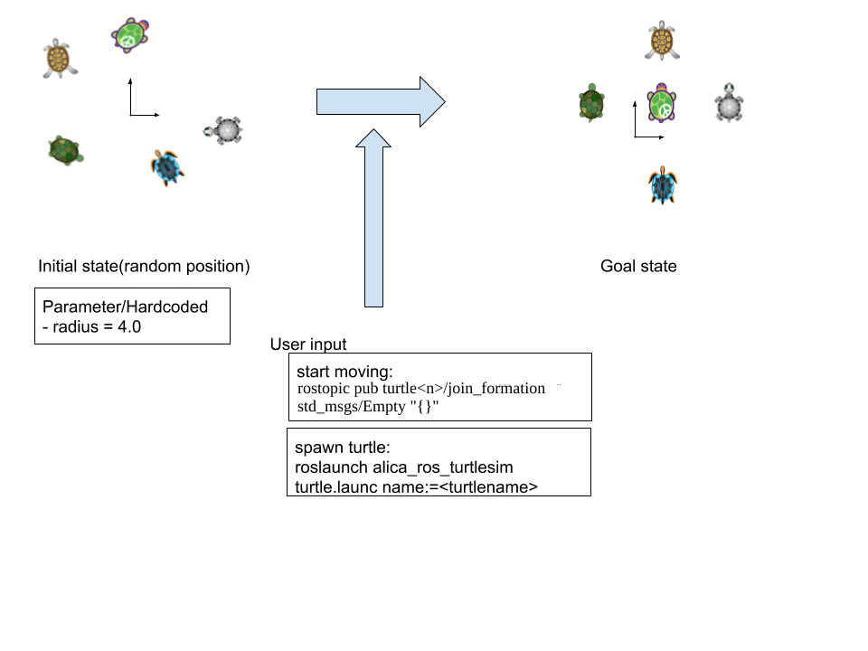
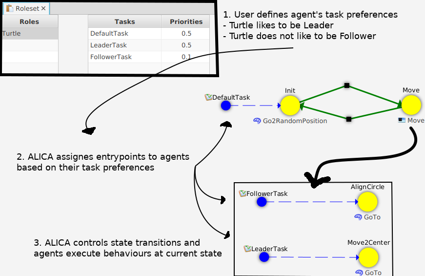
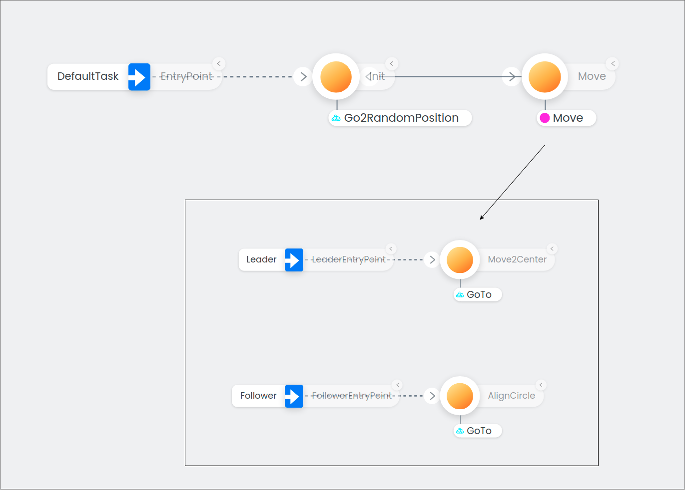
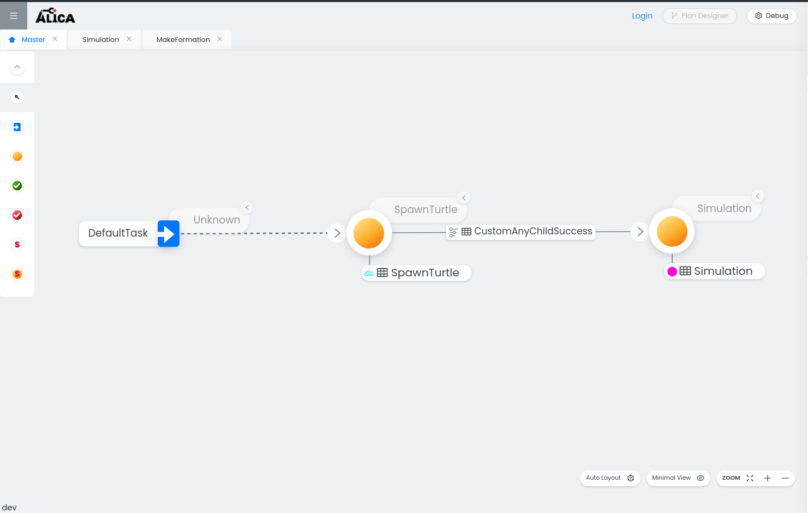
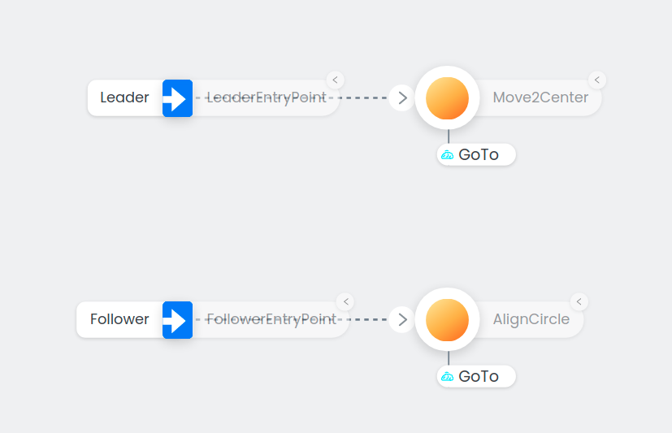

# Turtlesim Tutorial
## 1. Overview
This tutorial is an extension of the [turtlesim ROS package](http://wiki.ros.org/turtlesim). By following this tutorial, you will learn
- some of the core concepts of the ALICA language
- how to achieve multi-agent collaboration with the ALICA framework

In this tutorial, you will create an application as shown in the picture below. The ALICA engine will assign the `Leader` task to one turtle and the `Follower` task to the other turtles. Further, the ALICA engine will move the turtles to their goal positions based on distance constraints.




## 2. Prerequisite
You need to be familiar with following topics and tools:
- [ROS Melodic](http://wiki.ros.org/melodic/Installation/Ubuntu)
- [catkin_tools](https://catkin-tools.readthedocs.io/en/latest/installing.html)

## 3. The ALICA Language - Basics and Core Concepts
We will only give you a brief explanation on the ALICA core concepts. For the interested reader, we recommend to consider the [documentation](https://rapyuta-robotics.github.io/alica/) of the ALICA framework for more detailed information.
### Plan
A plan is a state machine in tree structure. Plans can include plans and states and each state can include `Behaviour`s. The ALICA engine assigns entrypoints of the  plan tree to the agents, e.g., robots based on `Role`, `Task`, `Constraints` and `Utility function`.
The ALICA engine manages state transitions based on the developers code. The ALICA plan designer generates method stubs that a developer will fill with state transition logic. The developer can create plans using the ALICA plan designer.

### Behaviour
The developer can write robot behaviours in C++ for each state. The ALICA plan designer generates method stubs and the developer implements the behaviour logic in these stubs. In this tutorial, there are the `Go2RandomPosition` and `GoTo` behaviour.
The turtles are teleported to random position with `Go2RandomPosition` and they go to their target position with  the `GoTo` behaviour.

### Role

A role is a task preference of the agent and it describes physical difference among agents , e.g., differences between a robotic arm and an AGV. In this tutorial all agent have same role:  `Turtle`

### Task
A task is assigned to an agent based on the `Role` of that agent and based on the `Utility function` of the plan. A task identifies an entry point of a state machine. The ALICA engine realises multi-agent collaboration by assigning tasks to agents. In this tutorial, there are the `Leader` and the `Follower` task. One turtle is assigned the `Leader` task and it moves to the centre. The other turtles are assigned the `Follower` task and they align in a circle.
### Constraints
Developers can set constraints to plans. The ALICA engine can solve constraints and return corresponding answers. In this tutorial, the turtles align in a circle defined by distance constraints.

### Worldmodel

The world model represents the model of the world from the perspective of an agent. Further, the world model can be an interface between the ALICA engine and other software, e.g., ROS and lower API.



## 4. Setup of the Catkin Workspace
We need to create a catkin workspace by executing the following steps in an Ubuntu18.04 terminal.

1. Check out the required repositories:

```
mkdir -p catkin_ws/src
cd catkin_ws/src
git clone https://github.com/rapyuta-robotics/alica.git
git clone https://github.com/rapyuta-robotics/alica-essentials.git
git clone https://github.com/rapyuta-robotics/alica-supplementary.git
```

2. Remove existing turtlesim files. You will reproduce these files (You can jump to step 8. "Build and Run" for testing application before deleting the files):

```
cd src/alica-supplementary
rm -r alica_ros_turtlesim/alica/Expr
rm -r alica_ros_turtlesim/alica/etc/plans
rm -r alica_ros_turtlesim/alica/etc/tasks
rm -r alica_ros_turtlesim/alica/etc/roles
```

3. Create subfolders in the alica_ros_turtlesim package:

```
mkdir -p alica_ros_turtlesim/alica/etc
```

## 5. Setup of the ALICA Plan Designer
The ALICA plan designer is a user interface to design applications with the ALICA framework.
### 5.1 Start the ALICA plan designer by following steps

The Plan Designer is a web application and can be started by using docker-compose.

For starting the Plan Designer, use the docker-compose file placed in alica-supplementary/alica_designer_runtime/
by navigating into the folder and executing the following command:

```
docker-compose up
```

You can open the Plan Designer with a browser of your choice by visiting the url
http://localhost:3030.

 When you start the Plan Designer the first time, its main window should look like this:


## 6. Create the Tutorial Plans with the Plan Designer
In this section, you will create plans using the ALICA plan designer.
In this tutorial there are two plans, `Master` and `Move`. The `Master`
plan has an `Init` and `Move` state.  The `Move` plan includes the
`Move2Center` and the `AlignCircle` state. In the `Init` state, the turtle
is teleported to a random position (`Go2RandomPosition` behaviour) and then
transitions to the `Move` state.



### 6.1 Create the TaskRepository
1. In the top right corner, click on "More" and select "Task".
2. Go to the tab "Task Repository", enter `TaskRepository` as the name of your
TaskRepository and click on "Create New".
3. Repeat step 1.
4. In the tab "Task", enter `DefaultTask` for the Task Name, select the TaskRepository `TaskRepository` in the
drop down menu and click on "Create New".

### 6.2 Create the Master Plan

1. Click on the menu button "Plan" in the top right corner. This will open a window
for creating a new plan on the right side of your browser window.
2. Enter 'Master' as the plan name and check the Master Plan checkbox at the bottom.
3. Click on "Create New" to create the Master Plan.

On the top left you will see a tab for your newly created Master Plan.

4. Add two states and set their names to `Init` and `Move`.
5. Add a transition from `Init` to `Move` and from `Move` to `Init`.
   1. Hover over the state `Init`.
   2. Click and hold while your cursor is on the plus symbol inside the circle appearing
   at the top of the state.
   3. Drag your mouse to the `Move` state. Let go of your mouse when your cursor is on the plus symbol
   inside the circle appearing at the top of the state `Move`.
   4. Repeat step 1-3 for the transition from `Move` to `Init`.
   5. Select the transition from `Init` to `Move`, delete the generated pre condition and create a new one.
   Make sure to check the "Enabled" checkbox. Do the same thing for the transition from `Move` to `Init`.
6. Create an entrypoint. Select `DefaultTask` as a Task and click on "Select".
7. Connect the entrypoint with the `Init` state.
8. Set the "Minimum Cardinality" of the entrypoint to 1 and the "Maximum Cardinality" to 2147483647.
9. Create the behaviour `Go2RandomPosition`.
   1. Click on "Behaviour" in the top right corner.
   2. Enter `Go2RandomPosition` as the behaviour name and set the frequency to 30.
   3. Click on "Create New" to create the behaviour.
10. Select the "Behaviours" tab, click on `Go2RandomPosition` and drag and drop it to the `Init` state.
11. Create a plan with the name `Move`. Do not check the "Master Plan" checkbox.
12. Select the "Plans" tab, click on `Move` and drag and drop it on the `Move` state.

### 6.3 Move plan

1. Open the `Move` plan by selecting it in the "Plans" tab.
2. Create two states `Move2Center` and `AlignCircle`.
3. Create two entrypoints with new tasks `Leader` and `Follower`.
4. For the Leader entrypoint, select it and set the value of "Minimum Cardinality" and "Maximum Cardinality" both to 1.
5. For the Follower entrypoint, select it and set the value of "Minimum Cardinality" to 0 and the value of "Maximum Cardinality" to 2147483647.
6. Connect the `LeaderTask` Task-Entrypoint to `Move2Center` and the `FollowerTask` Task-EntryPoint to `AlignCircle`.
7. Create the `GoTo` behaviour with a frequency of 30 and add it to the `Move2Center` state and the `AlignCircle`.
8. Select the `Move` plan and add a RuntimeCondition with the name `CircleRuntimeCondition`.
9. Click on the edit button of the CircleRuntimeConditon, select the Quantifiers tab.
10. Choose `Move` as the "Entity Name". Enter `x` and `y` separately into the "Sorts" field
and click on "Create New".
11. Close the edit window of CircleRuntimeConditon.

### 6.4 Create the RoleSet

1. In the top right corner click on "More" and select "Role".
2. Select the "Roleset" tab and create a RoleSet with the name `RoleSet` and check the
'Default Role Set' checkbox.
3. Repeat step 1. and create a role with the name `Turtle`. Select `RoleSet` as your Role Set.
4. Go to the tab `Task Priorities`, click on `Apply Task Priority`. Select the task `Follower` and set the
priority to 0.1.

### 6.5 Export files and generate code

1. In the top left corner click on the plus symbol and select `Export`. The browser will start a download of
the file `web_designer_program.zip`.
2. Extract the archive, open the alica_program folder and place `plans`, `roles` and the `tasks` into your
alica_ros_turtlesim/alica/etc/ folder.
3. Navigate into alica-supplementary/alica_designer_runtime and execute generate.sh with
```./generate.sh ../alica_ros_turtlesim/alica/```

Your generated files will be stored in /alica-supplementary/alica_ros_turtlesim/alica/Expr

## 7. Implement Logics

After the ALICA plan designer generated the method stubs, you need to modify/implement the logic in these stubs. In this section, the necessary code changes are explained for this.
### 7.1 World model

We will explain only `base.cpp` which is related to ALICA.

```c++
#include <BehaviourCreator.h>
#include <ConditionCreator.h>
#include <ConstraintCreator.h>
#include <PlanCreator.h>
#include <UtilityFunctionCreator.h>
#include <engine/AlicaContext.h>

#include <constraintsolver/CGSolver.h>
#include <clock/AlicaROSClock.h>
#include <communication/AlicaRosCommunication.h>
#include <clock/AlicaRosTimer.h>
#include <ros/ros.h>

#include <alica_ros_turtlesim/base.hpp>

namespace turtlesim
{

Base::Base(ros::NodeHandle& nh, ros::NodeHandle& priv_nh, const std::string& name, const std::string& roleset, const std::string& master_plan,
        const std::string& path)
{
    // create world model
    ALICATurtleWorldModel::init(nh, priv_nh);
    // Initialize Alica
    ac = new alica::AlicaContext(AlicaContextParams(name, path + "/etc/", roleset, master_plan, false));
    ac->setCommunicator<alicaRosProxy::AlicaRosCommunication>();
    ac->setTimerFactory<alicaRosTimer::AlicaRosTimerFactory>(4);
    ac->addSolver<alica::reasoner::CGSolver>();
}

void Base::start()
{
    alica::AlicaCreators creators(std::make_unique<alica::ConditionCreator>(), std::make_unique<alica::UtilityFunctionCreator>(),
            std::make_unique<alica::ConstraintCreator>(), std::make_unique<alica::BehaviourCreator>(),
            std::make_unique<alica::PlanCreator>());
    ac->init(creators);
}

Base::~Base()
{
    ac->terminate();
    delete ac;
    ALICATurtleWorldModel::del();
}

} // namespace turtlesim

```

- Base::Base() L2: Initialize World model. Since one agent has one world model, this method is class static method
- Base::Base() L4-7: Setting up AlicaContext. AlicaContext is the interface class of the ALICA engine.
- Base::start(): Starting the AlicaContext.

### 7.2 Plans

The ALICA plan designer generated everything plan related into the `alica/Expr` folder, split into src and include.
The `alica/Expr/src/<plan_name><plan_id>.cpp` files include `evaluate` functions that control the transition between
states of that plan. The `alica/Expr/src/constraints/<plan_name><plan_id>Constraints.cpp` files include the
`getConstraints` functions which provide the constraints. The frequency for calling these functions
can be configured in the `Alica.yaml` file under `alica/etc`. The IDs in the file names are generated by the
ALICA plan designer.

#### alica/Expr/src/Master<id>.cpp

In this file, you need to implement state transition logic.

```c++
#include "Master2425328142973735249.h"
/*PROTECTED REGION ID(eph2425328142973735249) ENABLED START*/
// Add additional options here
#include <alica_ros_turtlesim/world_model.hpp>
/*PROTECTED REGION END*/

namespace alica
{
// Plan:  Master (2425328142973735249)
//
// Tasks:
//   - DefaultTask (3310236980587704776) (Entrypoint: 2741715629576575326)
//
// States:
//   - Init (3997532517592149463)
//   - Move (2405597980801916441)
Master2425328142973735249::Master2425328142973735249()
        : DomainPlan()
{
    /*PROTECTED REGION ID(con2425328142973735249) ENABLED START*/
    // Add additional options here
    /*PROTECTED REGION END*/
}
Master2425328142973735249::~Master2425328142973735249()
{
    /*PROTECTED REGION ID(dcon2425328142973735249) ENABLED START*/
    // Add additional options here
    /*PROTECTED REGION END*/
}

/**
 * Task: DefaultTask  -> EntryPoint-ID: 2741715629576575326
 */
std::shared_ptr<UtilityFunction> UtilityFunction2425328142973735249::getUtilityFunction(Plan* plan)
{
    /*PROTECTED REGION ID(2425328142973735249) ENABLED START*/
    std::shared_ptr<UtilityFunction> defaultFunction = std::make_shared<DefaultUtilityFunction>(plan);
    return defaultFunction;
    /*PROTECTED REGION END*/
}
/**
 * Transition: 3486027875296378577 (3486027875296378577)
 *   - Comment:
 *   - Source2Dest: Init --> Move
 *
 * Precondition: Init2Move (1597434482701133956)
 *   - Enabled: true
 *   - PluginName: DefaultPlugin
 *   - ConditionString:
 *   - Variables:
 *   - Quantifiers:
 *
 * Abstract Plans in Init:
 *   - Go2RandomPosition (4085572422059465423)
 */
bool PreCondition1597434482701133956::evaluate(std::shared_ptr<RunningPlan> rp)
{
    /*PROTECTED REGION ID(3486027875296378577) ENABLED START*/
    return rp->isAnyChildStatus(PlanStatus::Success);
    /*PROTECTED REGION END*/
}
/**
 * Transition: 635844345274619238 (635844345274619238)
 *   - Comment:
 *   - Source2Dest: Move --> Init
 *
 * Precondition: Move2Init (1136497454350831106)
 *   - Enabled: true
 *   - PluginName: DefaultPlugin
 *   - ConditionString:
 *   - Variables:
 *   - Quantifiers:
 *
 * Abstract Plans in Move:
 *   - Move (1889749086610694100)
 */
bool PreCondition1136497454350831106::evaluate(std::shared_ptr<RunningPlan> rp)
{
    /*PROTECTED REGION ID(635844345274619238) ENABLED START*/
    return turtlesim::ALICATurtleWorldModel::get()->getInit();
    /*PROTECTED REGION END*/
}

/*PROTECTED REGION ID(methods2425328142973735249) ENABLED START*/
// Add additional options here
/*PROTECTED REGION END*/
} // namespace alica

```

- L4 : include world model since state transitions depend on the world model
- `PreCondition1597434482701133956::evaluate`:  This is the transition condition from ‘Init’ to ‘Move’. This success condition is met by calling setSuccess in behaviour logic which is explained later in "Behaviours".
- `PreCondition1136497454350831106::evaluate`: This is the transition condition from ‘Move’ to ‘Init’. This condition is met by publishing to the rostopic `/init`.

#### alica/Expr/src/Move<id>.cpp

```c++
#include "Move1889749086610694100.h"
/*PROTECTED REGION ID(eph1889749086610694100) ENABLED START*/
// Add additional options here
/*PROTECTED REGION END*/

namespace alica
{
// Plan:  Move (1889749086610694100)
//
// Tasks:
//   - Follower (3759439551323513525) (Entrypoint: 3277312192440194145)//   - Leader (826983480584534597) (Entrypoint: 4346694000146342467)
//
// States:
//   - AlignCircle (2299237921449867536)
//   - Move2Center (4158797811607100614)
Move1889749086610694100::Move1889749086610694100()
        : DomainPlan()
{
    /*PROTECTED REGION ID(con1889749086610694100) ENABLED START*/
    // Add additional options here
    /*PROTECTED REGION END*/
}
Move1889749086610694100::~Move1889749086610694100()
{
    /*PROTECTED REGION ID(dcon1889749086610694100) ENABLED START*/
    // Add additional options here
    /*PROTECTED REGION END*/
}

// Check of RuntimeCondition - (Name): CircleRuntimeCondition, (ConditionString): , (Comment) :

/**
 * Available Vars:
 */
bool RunTimeCondition1288817888979746811::evaluate(std::shared_ptr<RunningPlan> rp)
{
    /*PROTECTED REGION ID(1288817888979746811) ENABLED START*/
    return true;
    /*PROTECTED REGION END*/
}
/**
 * Task: Follower  -> EntryPoint-ID: 3277312192440194145
 * Task: Leader  -> EntryPoint-ID: 4346694000146342467
 */
std::shared_ptr<UtilityFunction> UtilityFunction1889749086610694100::getUtilityFunction(Plan* plan)
{
    /*PROTECTED REGION ID(1889749086610694100) ENABLED START*/
    std::shared_ptr<UtilityFunction> defaultFunction = std::make_shared<DefaultUtilityFunction>(plan);
    return defaultFunction;
    /*PROTECTED REGION END*/
}

/*PROTECTED REGION ID(methods1889749086610694100) ENABLED START*/
// Add additional options here
/*PROTECTED REGION END*/
} // namespace alica

```

In this file, you need to set the runtime condition to always return true.

* `RunTimeCondition1288817888979746811::evaluate`: Always returns true. Only the attached constraint is important (see next file).

#### alica/Expr/src/constraints/Move<id>Constraints.cpp

In this file, you need to implement constraints logic.

```c++
#include "constraints/Move1889749086610694100Constraints.h"
/*PROTECTED REGION ID(ch1889749086610694100) ENABLED START*/
// Add additional options here
#include <alica_ros_turtlesim/world_model.hpp>
#include <autodiff/AutoDiff.h>
#include <engine/RunningPlan.h>
#include <engine/constraintmodul/ProblemDescriptor.h>
#include <engine/model/Task.h>
/*PROTECTED REGION END*/

namespace alica
{
// Plan:Move
/*
 * Tasks:
 * - EP:3277312192440194145 : Follower (3759439551323513525)
 * - EP:4346694000146342467 : Leader (826983480584534597)
 *
 * States:
 * - AlignCircle (2299237921449867536)
 * - Move2Center (4158797811607100614)
 *
 * Vars:
 */
/**
 * RuntimeCondition - (Name): CircleRuntimeCondition
 * (ConditionString):
 * Static Variables:
 * Domain Variables:
 * forall agents in Move let v = [x, y]
 *
 */
void Constraint1288817888979746811::getConstraint(std::shared_ptr<ProblemDescriptor> c, std::shared_ptr<RunningPlan> rp)
{
    /*PROTECTED REGION ID(cc1288817888979746811) ENABLED START*/
    using autodiff::TermPtr;
    autodiff::TermHolder* h = static_cast<autodiff::TermHolder*>(c->getContext());
    TermPtr constraint = h->trueConstant();

    // set utility as constant which means result meet only constraints.
    // if you set non constant, ALICA will maximize the utility.
    c->setUtility(h->constant(1));

    // iterate through agents
    const int agent_num = static_cast<int>(c->getAgentVars().size());
    for (int i = 0; i < agent_num; ++i) {
        // get variables which is define in editor->Runtime condition->Quantifiers
        autodiff::Variable* x = static_cast<autodiff::Variable*>(c->getAgentVars()[i].getVars()[0]);
        autodiff::Variable* y = static_cast<autodiff::Variable*>(c->getAgentVars()[i].getVars()[1]);

        // check agent is leader
        const alica::EntryPoint* agent_entrypoint = rp->getAssignment().getEntryPointOfAgent(c->getAgentVars()[i].getId());
        if (!agent_entrypoint) {
            // Engine doesn't guarantee consistent plan view during this function execution. A null entry
            // point means that the plan status changed between the time this function was invoked
            // and entry point was requested. Don't do anything now and ignore further constraints building.
            return;
        }

        const bool is_leader = agent_entrypoint->getTask()->getName() == "Leader";

        // set range of variables
        // 0~10 is turtlesim default area size -> center is (5,5)
        x->editRange().intersect(0, 10);
        y->editRange().intersect(0, 10);
        autodiff::TVec<2> pos(x, y);

        // place turtle between radius_min and radius_max
        constexpr float tolerance = 0.1;
        constexpr float radius = 2.5;
        constexpr float radius_min = radius - tolerance;
        constexpr float radius_max = radius + tolerance;
        const autodiff::TVec<2> center(h->constant(5.0), h->constant(5.0));

        if (is_leader) // leader goes to center
        {
            constraint &= autodiff::equals(pos, center, tolerance);
        } else // follower keep distance from center and other followers
        {
            // keep distance from center
            TermPtr dist_to_center_sqr = autodiff::distanceSqr(pos, center);
            constraint &= (dist_to_center_sqr < h->constant(radius_max * radius_max));
            constraint &= (dist_to_center_sqr > h->constant(radius_min * radius_min));

            // keep distance among followers
            for (int j = i + 1; j < agent_num; ++j) {
                // check agent is leader
                // another way to check agent is Leader
                const alica::EntryPoint* other_agent_entrypoint = rp->getAssignment().getEntryPointOfAgent(c->getAgentVars()[j].getId());
                if (!other_agent_entrypoint) {
                    // Engine doesn't guarantee consistent plan view during this function execution. A null entry
                    // point means that the plan status changed between the time this function was invoked
                    // and entry point was requested. Don't do anything now and ignore further constraints building.
                    return;
                }

                const bool is_others_leader = (other_agent_entrypoint->getId() == 4346694000146342467);
                if (!is_others_leader) {
                    autodiff::Variable* x_other = static_cast<autodiff::Variable*>(c->getAgentVars()[j].getVars()[0]);
                    autodiff::Variable* y_other = static_cast<autodiff::Variable*>(c->getAgentVars()[j].getVars()[1]);
                    const autodiff::TVec<2> pos_other(x_other, y_other);
                    TermPtr dist_to_other_sqr = autodiff::distanceSqr(pos, pos_other);

                    // calculate distance for neighbors
                    float dis_between_followers = 2.0 * radius * sin(M_PI / (float) (agent_num - 1)) - tolerance;
                    constraint &= (dist_to_other_sqr > h->constant(dis_between_followers * dis_between_followers));
                }
            }
        }
    }

    c->setConstraint(constraint);
    /*PROTECTED REGION END*/
}

// State: AlignCircle
// State: Move2Center
} // namespace alica
```


  - L3~7: include alica engine related header files and world model.
  - L46~110: Iterate over all agents and add constraints for each
  - L47~73: Preparing/getting variables and add range constraints
  - L77: add constraints for `Leader` agent. Leader agent moves to center of circle within tolearence
  - L81~L108: Iterate other agent to add constraints to keep distance among `Follower` agents. (Please note that copy-paste won't work, because you generated an entrypoint ID that is different from the one given in the repository. Enter the ID of the Leader entrypoint of your move plan here.)

### 7.3  Behaviours
The auto-generated <behaviour_name>.cpp files under alica/Expr/src  have a `run` function which keeps running at the frequency specified when you created the behaviours in the plan designer.
#### alica/Expr/src/Go2RandomPosition.cpp

In this file, you need to implement the teleportation of the  turtles:

```c++
#include "Go2RandomPosition.h"
#include <memory>

/*PROTECTED REGION ID(inccpp4085572422059465423) ENABLED START*/
// Add additional includes here
#include <alica_ros_turtlesim/world_model.hpp>
#include <random>
/*PROTECTED REGION END*/

namespace alica
{
/*PROTECTED REGION ID(staticVars4085572422059465423) ENABLED START*/
// initialise static variables here
/*PROTECTED REGION END*/

Go2RandomPosition::Go2RandomPosition()
        : DomainBehaviour("Go2RandomPosition")
{
    /*PROTECTED REGION ID(con4085572422059465423) ENABLED START*/
    // Add additional options here
    /*PROTECTED REGION END*/
}
Go2RandomPosition::~Go2RandomPosition()
{
    /*PROTECTED REGION ID(dcon4085572422059465423) ENABLED START*/
    // Add additional options here
    /*PROTECTED REGION END*/
}
void Go2RandomPosition::run(void* msg)
{
    /*PROTECTED REGION ID(run4085572422059465423) ENABLED START*/
    if (isSuccess()) {
        return;
    }

    // code for generate random value between 0 and 10 which is default turtlesim area size
    std::random_device seed_gen;
    std::default_random_engine engine(seed_gen());
    std::uniform_real_distribution<> dist(0, 10.0);

    // teleport turtle to random place
    turtlesim::ALICATurtleWorldModel::get()->turtle.teleport(dist(engine), dist(engine));
    turtlesim::ALICATurtleWorldModel::get()->setInit(false);
    setSuccess();
    /*PROTECTED REGION END*/
}
void Go2RandomPosition::initialiseParameters()
{
    /*PROTECTED REGION ID(initialiseParameters4085572422059465423) ENABLED START*/
    // Add additional options here

    /*PROTECTED REGION END*/
}
/*PROTECTED REGION ID(methods4085572422059465423) ENABLED START*/
// Add additional options here
/*PROTECTED REGION END*/

} /* namespace alica */

```

- L6: Include world model
- `Go2RandomPosition::run`: Generate random value and teleport turtle via world model.
- `Go2RandomPosition::run`: After executing `setSuccess()`, `isAnyChildStatus(PlanStatus::Success)` at alica/Expr/src/Master***.cpp returns true. Then the state transition from `Init` to `Move` will be executed.

#### alica/Expr/include/GoTo.h

```c++
#pragma once

#include "DomainBehaviour.h"
/*PROTECTED REGION ID(inc4054297592460872311) ENABLED START*/
// Add additional includes here
#include <engine/constraintmodul/Query.h>
/*PROTECTED REGION END*/

namespace alica
{
class GoTo : public DomainBehaviour
{
public:
    GoTo();
    virtual ~GoTo();
    virtual void run(void* msg);
    /*PROTECTED REGION ID(pub4054297592460872311) ENABLED START*/
    // Add additional protected methods here
    /*PROTECTED REGION END*/
protected:
    virtual void initialiseParameters();
    /*PROTECTED REGION ID(pro4054297592460872311) ENABLED START*/
    // Add additional protected methods here
    /*PROTECTED REGION END*/
private:
    /*PROTECTED REGION ID(prv4054297592460872311) ENABLED START*/
    // Add additional private methods here
    alica::Query _query;
    std::vector<double> _results;
    /*PROTECTED REGION END*/
};
} /* namespace alica */
```
- L6: Include Query
- private variables: Add query and result which are used to get the solver result.

#### alica/Expr/src/GoTo.cpp

```c++
#include "GoTo.h"
#include <memory>

/*PROTECTED REGION ID(inccpp4054297592460872311) ENABLED START*/
// Add additional includes here
#include <alica_ros_turtlesim/world_model.hpp>
#include <constraintsolver/CGSolver.h>
/*PROTECTED REGION END*/

namespace alica
{
/*PROTECTED REGION ID(staticVars4054297592460872311) ENABLED START*/
// initialise static variables here
/*PROTECTED REGION END*/

GoTo::GoTo()
        : DomainBehaviour("GoTo")
{
    /*PROTECTED REGION ID(con4054297592460872311) ENABLED START*/
    // Add additional options here
    /*PROTECTED REGION END*/
}
GoTo::~GoTo()
{
    /*PROTECTED REGION ID(dcon4054297592460872311) ENABLED START*/
    // Add additional options here
    /*PROTECTED REGION END*/
}
void GoTo::run(void* msg)
{
    /*PROTECTED REGION ID(run4054297592460872311) ENABLED START*/
    // solve constraints and get value
    if (!_query.getSolution<reasoner::CGSolver, double>(getPlanContext(), _results)) {
        std::cout << getName() << " - Solution to query not found." << std::endl;
        return;
    }
    // move turtle to goal
    if (turtlesim::ALICATurtleWorldModel::get()->turtle.move_toward_goal(_results[0], _results[1])) {
        setSuccess(); // set success if turtle reach goal
    }
    /*PROTECTED REGION END*/
}
void GoTo::initialiseParameters()
{
    /*PROTECTED REGION ID(initialiseParameters4054297592460872311) ENABLED START*/
    // Add additional options here
    _query.clearDomainVariables();
    _query.addDomainVariable(getEngine()->getTeamManager().getDomainVariable(getOwnId(), "x"));
    _query.addDomainVariable(getEngine()->getTeamManager().getDomainVariable(getOwnId(), "y"));
    /*PROTECTED REGION END*/
}
/*PROTECTED REGION ID(methods4054297592460872311) ENABLED START*/
// Add additional options here
/*PROTECTED REGION END*/

} /* namespace alica */
```

- L6-7: Include world model and CGSolver
- `GoTo::run`: Inside the `run` function,  get a result from the solver. The CGSolver solves constraints defined in the  alica/Expr/src/constraints/Move***.cpp
- `GoTo::run`: Move turtle to the solver result position via world model.
- `GoTo::initialiseParameters`: Add variable to query. `x` and `y` was defined when  “Quantifiers” of “Runtime Condition” was added in the ALICA plan designer

## 8. Build and Run
### 8.1 Build
follow the standard ros build step.
```
cd catkin_ws
source /opt/ros/$(ls /opt/ros)/setup.bash
source ./devel/setup.bash
catkin build alica_ros_turtlesim
```
### 8.2 Run
Run application with roslaunch. video
- Launch turtlesim
			`roslaunch alica_ros_turtlesim env.launch`
- Turtle node(you can launch turtle with different name till 5 turtles)
`roslaunch alica_ros_turtlesim turtle.launch name:=turtle1`
- Start moving.
`rostopic pub /init std_msgs/Empty "{}" `


## 9. Troubleshooting

### 9.1 Unknown quantifier type encountered

If you get the following error message when starting a turtle
`Unknown quantifier type encountered!`, have a look at the
file `alica/etc/plans/Move.pml` and make sure the value of the field
`quantifierType` is set to `"all"`.
