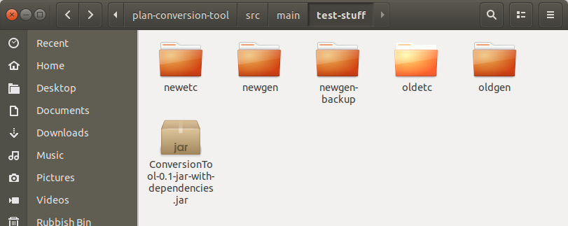

# Plan Conversion Tool (PCT)

The purpose of the Plan Conversion Tool (PCT) is to convert ALICA plans from the XML format of the old Plan Designer to the JSON format of the new Plan Designer. 

## How to use PCT / Step-by-step

1. Prepare work directories for the conversion process.

	1.1 Create the following 5 folders aside of the PCT-JAR file: oldetc, oldgen, newetc, newgen, newgen-backup
	1.2 Copy the content of your etc folder into oldetc.
	1.3 Copy the content of your autogenerated folder into oldgen and into newgen-backup.

2. Move the content of the newgen-backup/src/Plans folder into newgen-backup/src and delete the empty Plans folder afterwards.

3. Move the content of the newgen-backup/include/Plans folder into newgen-backup/include and delete the empty Plans folder afterwards.

4. Copy the content of the newgen-backup folder into the newgen folder.

5. Execute the conversion tool with the following 5 parameters once per role set file (*.rset) you want to convert:

   `java -jar ConversionTool-0.1-jar-with-dependencies.jar <abs-path-to-oldetc> <abs-path-to-newetc> <abs-path-to-newgen> <abs-path-to-defaultPlugin.jar> <path-to-Roleset.rset>`

   * Note: The defaultPlugin.jar is located in alica-plan-designer-fx/alica-plan-designer-fx-default-plugin/target and named "alica-plan-designer-fx-default-plugin-1.0-SNAPSHOT.jar"

6. Execute the conversion tool once with the following 5 parameters:
   `java -jar ConversionTool-0.1-jar-with-dependencies.jar <abs-path-to-oldetc> <abs-path-to-newetc> <abs-path-to-newgen> <abs-path-to-defaultPlugin.jar> *`

   * Note: This will convert the actual plan files and trigger the code generation correctly.

7. Delete the content of your autogenerated and etc folder and copy the content of the newgen and newetc folder into autogenerated and etc, respectively.

Now everything is back in place and you can start to fix potential compile errors in your protected regions. The should all be straight forward to fix. If you lost the content of a protected region during conversion or something got really messed up, you can either restart the conversion process (see below), or consider the [long version of this Readme.md file](https://github.com/rapyuta-robotics/alica/blob/rr_devel/supplementary/plan-conversion-tool/Readme.md) in the PCT repository.

If you want to **restart the conversion process** for some reason, do the following:

1. Delete the content of the newgen and newetc folder.

 	2. Copy the content of the newgen-backup folder into the newgen folder.
   	3. Execute the conversion from Step 5 or 6 again.
